# `Source Insight`

**简介**：`Source Insight`是一个功能强大的代码阅读器，可以用于便利的查看、跳转，它能使大量的代码产生联系，方便阅读，而且支持各种语言的程序代码。

有了它我们可以方便的阅读代码，而不用受到一些编译器的限制，例如解析缓存不够等问题导致代码无法正常跳转。

## 安装

### 下载：

[Source Insight Programming Editor and Code Browser](https://www.sourceinsight.com/)

### 激活

通过网盘分享的文件：Source Insight
链接: https://pan.baidu.com/s/11L-rq0d_honw2tRGrif17g?pwd=nyzk 提取码: `nyzk`

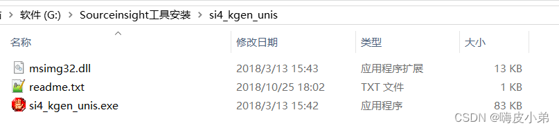

解压后将里面的`msimg32.dll`复制黏贴到`Source Insight`安装目录

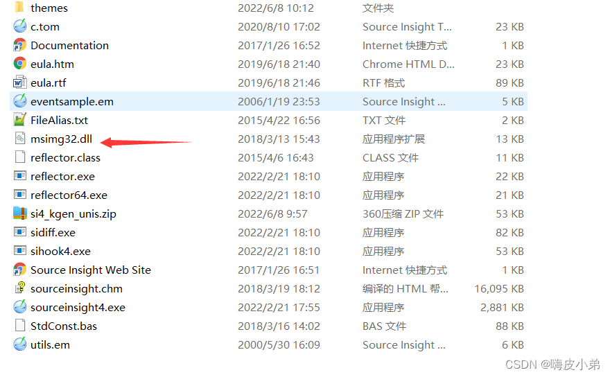

打开`si4_kgen_unis.exe`， 点击Generate生成key文件

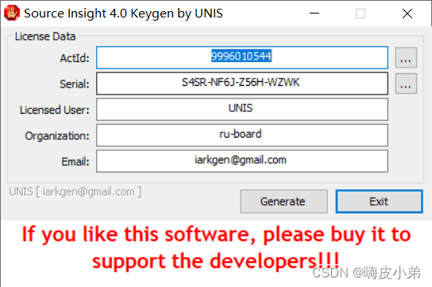

`C:\ProgramData\Source Insight\4.0` 是软件key文件存放位置

> [!important]
>
> 不要改动保存位置！！

三、Source Insight使用方法
3.1 添加工程

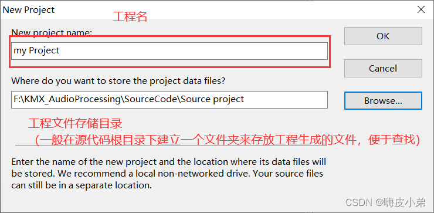

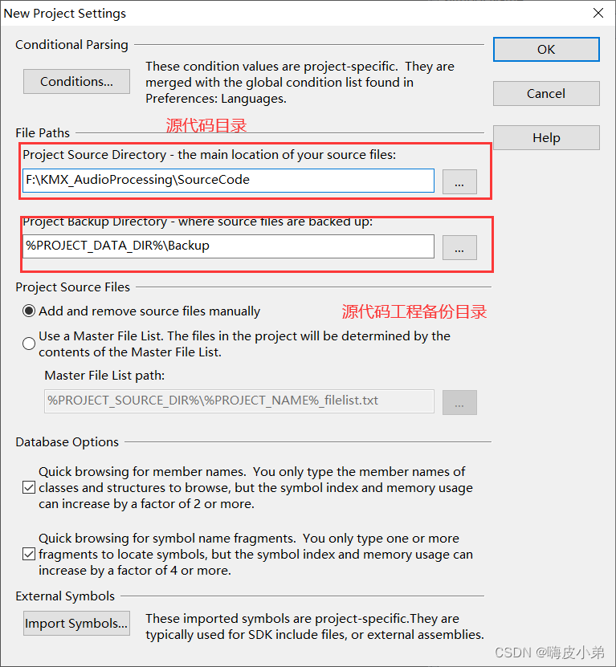

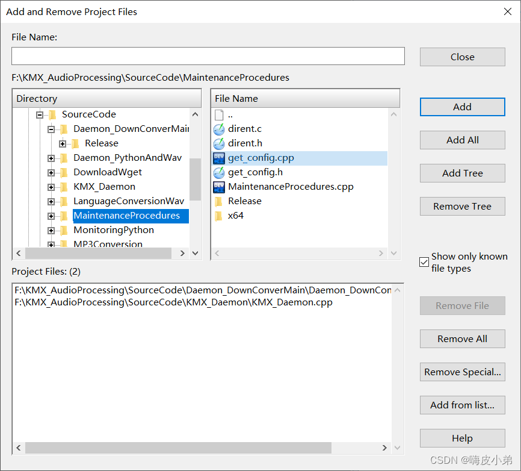

完成后点击close即可

3.2 使用技巧
1、将添加的代码进行同步，生成阅读代码的索引和辅助文件，方便对源代码进行阅读;点击**Project–> synchronization file**,会弹出下图框图:

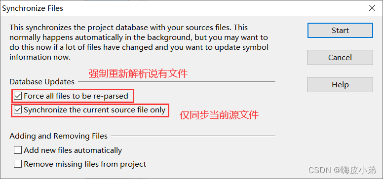

2、选择语言和后缀名的文件,点击**Options–>File type Options**,弹出下图框图

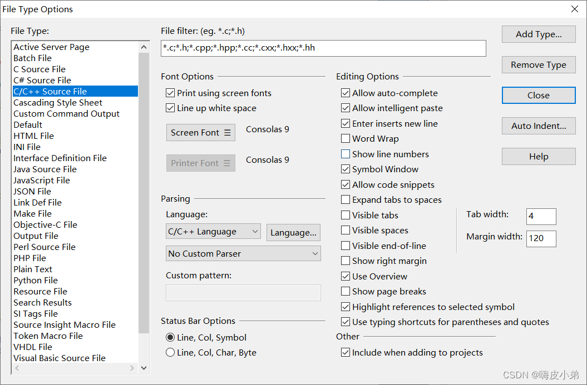

3、选中字符，相同字符高亮，点击**Options–>File type Options**,弹出下图框图，标注项选上：

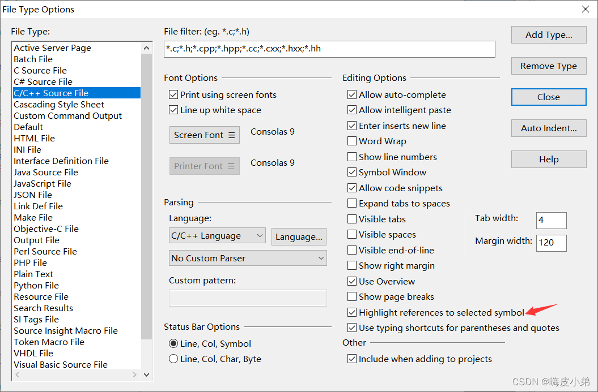

效果如下：

创建完成后，整个界面显示布局如下

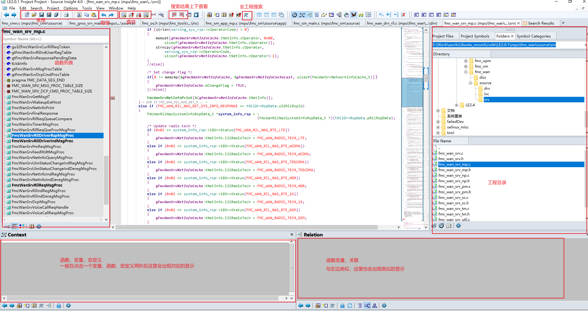

4、显示调用关系

当选择某个函数时，显示函数调用流程，选择某个函数 -> 右键 -> Show in Relation Window，如下图所示。

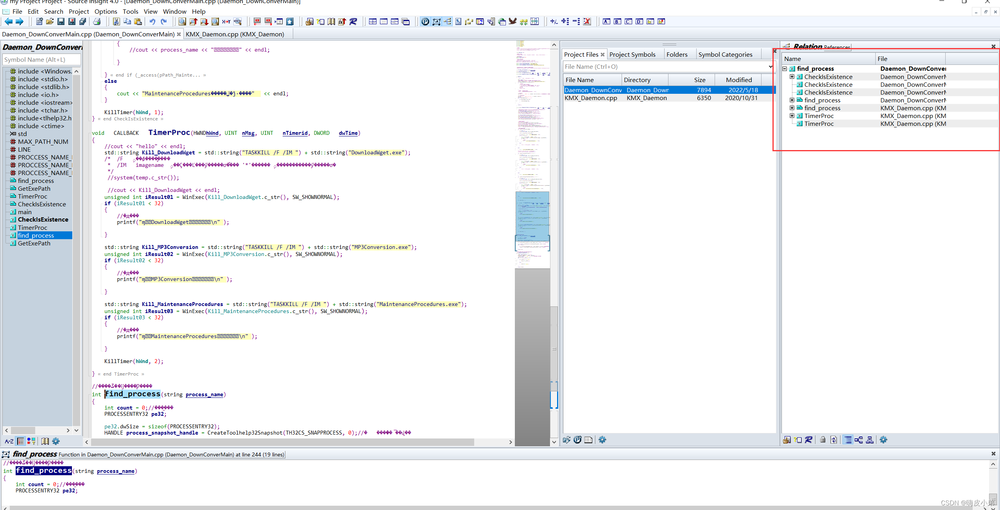

5、全局查找

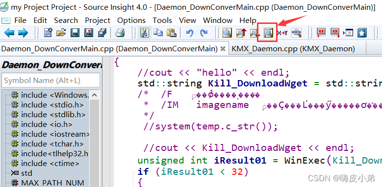

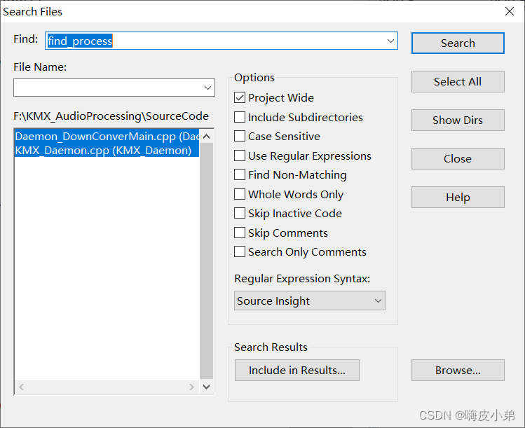

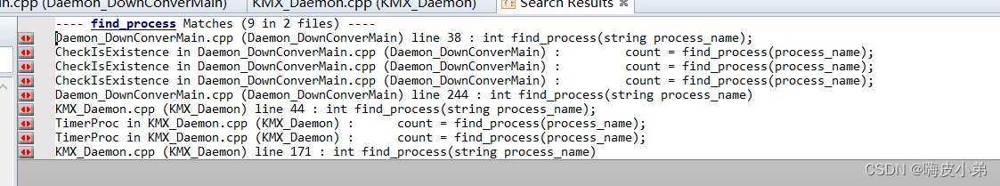

6、全工程搜索(lookup Reference)：

它的作用是在全工程所有文件，而不仅是当前文件里，搜索所有匹配的代码行。

利用倒数第三个框里的两个图标可以上下切换找到的匹配代码。

7、解决中文乱码问题

单个文件：File -> Reload Enconding…

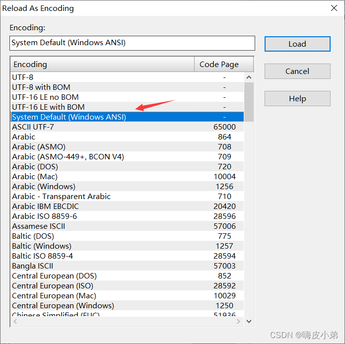

所有文件：Options > Preferences >File标签。

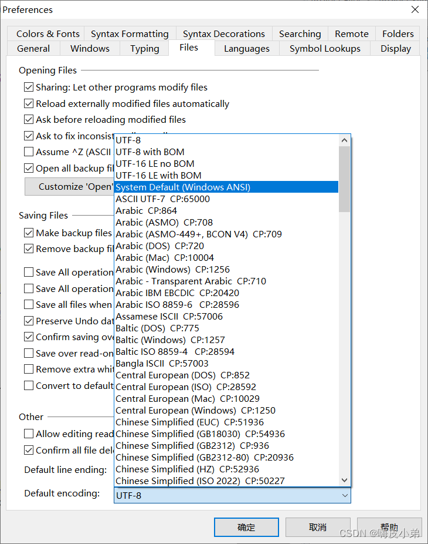