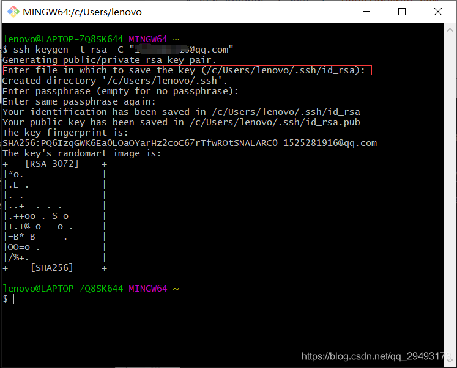
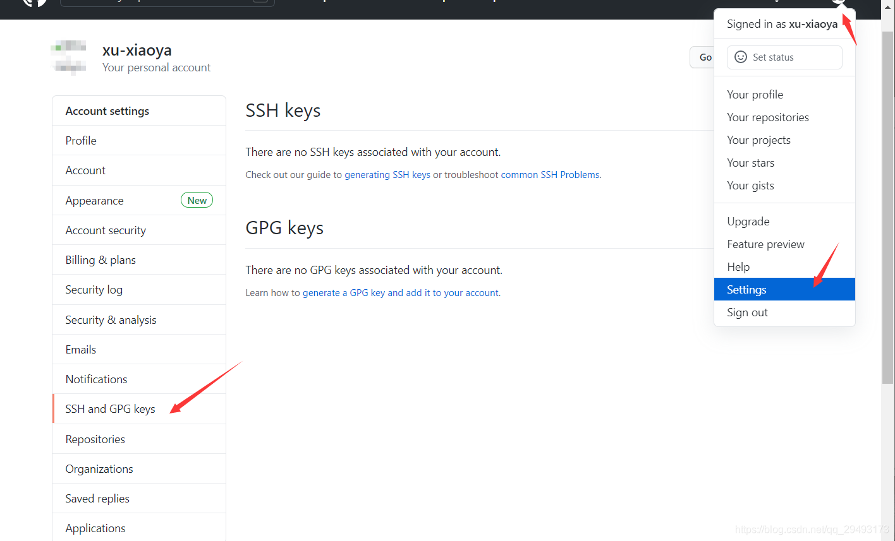
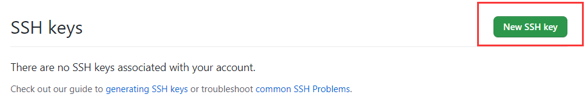
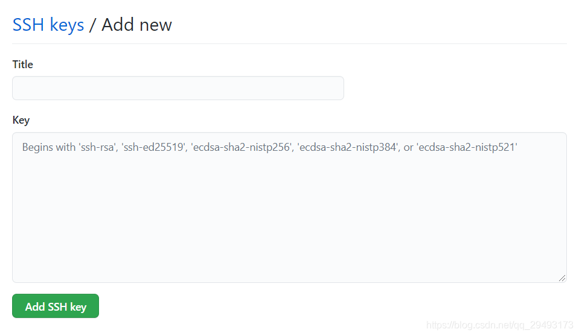
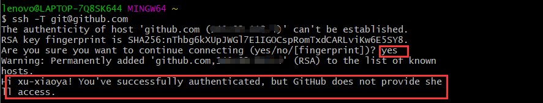
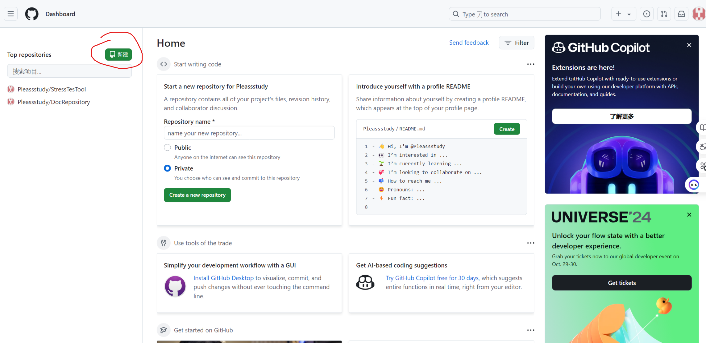
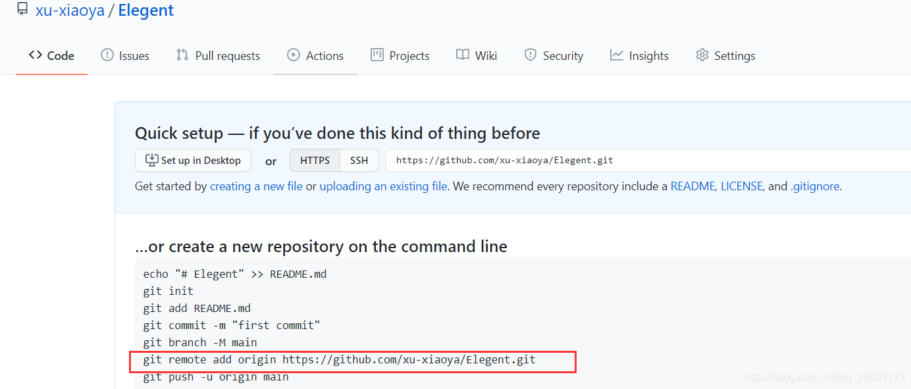

## `git`常用操作

### 基础配置

这部分是使用`git`必须要进行的配置，请务必查看并配置好

- `git`安装（略）

- `config`设置

  - ```
    $ git config --global user.name  "name"//自定义用户名
    $ git config --global user.email "youxiang@qq.com"//用户邮箱
    ```

> 这里设置的是自己提交时候显示的提交人姓名与邮箱

- 创建并添加`SSH`密钥

  - `ssh-keygen -t rsa -C "youxiang@qq.com"`
    - 这里的邮箱是你的`git`邮箱，下面红色的部分可以直接回车

  

  - 切换工作目录`cd ~`
  - `cd .ssh`
  - 查看生成的公钥`cat id_rsa.pub`
  - 将生成的公钥复制黏贴到`github`账户（其他代码管理网站同理）设置当中

  

  ----------------------------------------------分隔线-----------------------------------------------

  

  ----------------------------------------------分隔线-----------------------------------------------

  

  - 配置结束后进行验证：`ssh -T git@github.com`

  


### 搭建远程仓库

这里我们将以`github`为例子，搭建一个属于自己的远程仓库

- 创建远程仓库



之后跟着流程走，创建对应的远程仓库名称

- 关联远程仓库
  - 创建对应文件夹（最好与仓库同名）
  - `git init`初始化本地仓库
  - 运行下图红框命令



- 初始化远程仓库（也就是创建一个文件放进远程仓库里，一般使用`README.md`）
  - 创建一个`README.md`文件
  - 使用`git add README.md`将文件加入暂存区
  - 使用`git commit -m "修改内容说明"`将文件加入工作区
  - 使用`git push origin master`将文件推送至远程仓库

--------------------------------------------------注释--------------------------------------------------

如果创建远程仓库的时候勾选了生成`REAME`文件（不需要初始化了），就需要使用`git pull origin master`把`README`拉下来，才可以正常`push`

--------------------------------------------------`END`--------------------------------------------------


### 克隆远程仓库（已搭建）

对于已经搭建好的远程仓库，就不需要像未搭建的那么麻烦了，只需要使用

`git clone git@github.com:用户名/仓库名.git`

即可

### 将本地修改同步至远程仓库

- 确保本地的代码是最新的`git pull origin master`
- 查看本地文件状态`git status`
  - 这会显示哪些文件被修改、哪些文件未被追踪，以及哪些文件已经 staged（暂存）但尚未提交。

- 将本地文件提交至暂存区：

  ```
  #单个文件
  git add <file-name>
  #所有修改文件
  git add .
  ```

- 提交修改

  ```
  #单语句说明
  git commit -m "你的修改内容"
  #多语句说明（推荐）
  git commit
  #这会打开一个文件，操作类似vim，建议提交的修改内容为
  【修改文件】xxx
  【修改内容】xxx
  ```

- 推送至远程仓库`git push origin master`


### 提交出现冲突的解决办法

- 首先拉取最新的代码`git pull origin master`
- 解决冲突：如果存在冲突，`Git `会标记出冲突的文件，提示你手动解决冲突。你需要打开冲突的文件并手动解决这些冲突。
- 解决冲突后，根据上面的流程提交上传仓库

```
git add <file-name>
git commit -m "解决冲突"
git push origin master
```


### 查看远程仓库是否有更新

```
git status
```

若是远程分支有更新，会显示

```
Your branch is behind 'origin/main' by 2 commits, and can be fast-forwarded.
```


查看远程分支的日志：

```
git log origin/<branch-name>
```

比较远程分支与本地的提交

```
git log <branch-name>..origin/<branch-name>#提交差异
git diff <branch-name> origin/<branch-name>#差异
```


### `git`仓库中包含其他`github`仓库的方式

`git`中包含其他项目的仓库以便使用，可以使用`submodule`

具体使用方式如下：

1. 使用如下命令添加`git submodule add <url> path/to/submodule`
2. 添加之后，本地`git`仓库会克隆目标`url`至本地，同时远程仓库会添加该链接

>  其余设备拉取远程仓库后，需要使用命令`git submodule init`初始化该子模块
>
> 之后使用`git submodule update`更新，就会拉取该子模块远程仓库的最新分支
>
> 这两个命令可以使用如下命令一次性执行：
>
> `git submodule update --init`

若是使用添加命令的时候添加了无效的`url`，运行`git submodule update --init`的时候就会报错，提示`url`无效，此时可以删除该`submodule`

命令：

```shell
git rm --cached path/to/submodule
```

该命令从缓存中删除子模块在父仓库中的引用

然后执行命令：

```shell
rm -rf path/to/submodule
```

删除之后提交更改就可以同步到远程仓库

```
git commit -m "remove submodule"
git push origin master
```


## git修改远程仓库链接方式

要修改 Git 远程仓库的链接，可以使用 `git remote set-url` 命令。以下是具体步骤：

---

### **1. 查看当前远程仓库配置**

首先确认当前远程仓库的名称和链接：
```bash
git remote -v
```
这会显示类似以下内容（默认远程仓库通常叫 `origin`）：
```
origin  https://github.com/用户名/旧仓库.git (fetch)
origin  https://github.com/用户名/旧仓库.git (push)
```

---

### **2. 修改远程仓库链接**
使用以下命令修改远程仓库的 URL（将 `origin` 替换为你的远程仓库名称，`新仓库URL` 替换为目标仓库地址）：
```bash
git remote set-url origin 新仓库URL
```

#### **示例**
• 如果从 HTTPS 切换到 SSH：
  ```bash
  git remote set-url origin git@github.com:用户名/新仓库.git
  ```
• 如果更换为另一个 HTTPS 链接：
  ```bash
  git remote set-url origin https://github.com/用户名/新仓库.git
  ```

---

### **3. 验证修改是否成功**
再次运行 `git remote -v`，检查远程仓库链接是否已更新：
```bash
git remote -v
```
输出应显示新的 URL：
```
origin  git@github.com:用户名/新仓库.git (fetch)
origin  git@github.com:用户名/新仓库.git (push)
```

---

### **其他相关操作**
• **添加新的远程仓库**（而不是修改现有仓库）：
  ```bash
  git remote add 新名称 新仓库URL
  ```
  例如：
  ```bash
  git remote add upstream https://github.com/其他用户/仓库.git
  ```

• **删除远程仓库**（如果需要）：
  ```bash
  git remote remove origin
  ```

---

### **常见问题**
1. **权限错误**：如果使用 SSH 协议，确保你的 SSH 密钥已添加到 Git 平台（如 GitHub/GitLab）。
2. **协议切换**：HTTPS 和 SSH 的 URL 格式不同，确保使用正确的协议：
   • HTTPS：`https://github.com/用户名/仓库.git`
   • SSH：`git@github.com:用户名/仓库.git`

完成后，你的本地仓库将关联到新的远程地址，后续 `git push` 或 `git pull` 会指向新仓库。


