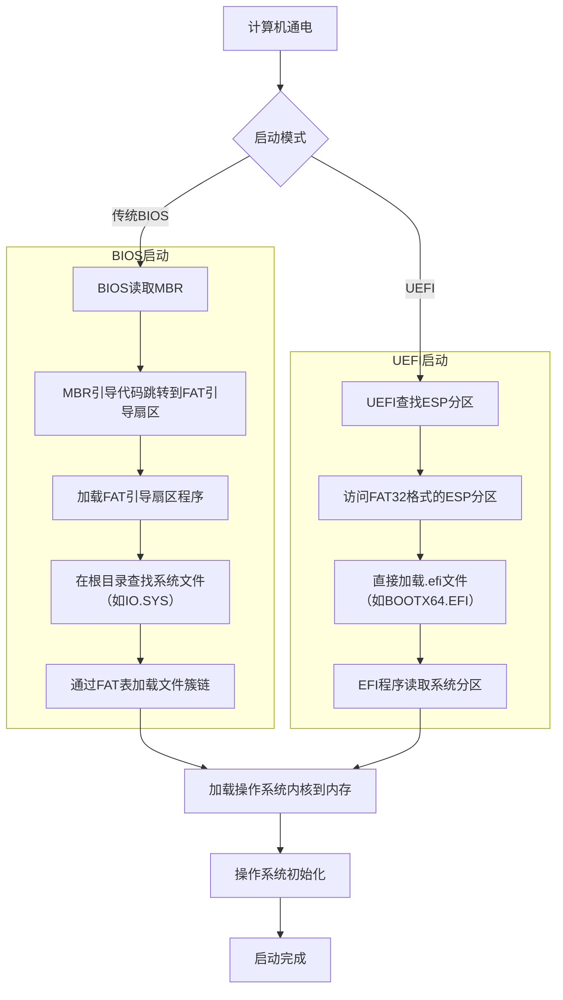

# 计算机系统基础

## FAT文件系统

**FAT文件系统**​（File Allocation Table，文件分配表）就像一本“文件地图”，帮助电脑快速找到U盘、SD卡等存储设备中的文件。

FAT文件系统的结构可以想象成一个“图书馆的管理手册”，由几个关键部分组成，用简单的方式解释如下：

---

### **1. 引导扇区（Boot Sector）**  

**作用**：相当于“说明书首页”，告诉电脑这个存储设备的基本信息。  
• 包含：磁盘大小、每个簇（存储块）的大小、FAT表的数量、版本（FAT12/16/32）等。  
• **例子**：就像一本书的目录页，写明了这本书有多少章、每章多少页。


---

### **2. FAT表（File Allocation Table）**  

**作用**：核心的“文件地图”，记录每个文件存储在哪些位置。  
• **结构**：一个数字表格，每个数字代表一个“簇”（存储块）的状态：  
  • `0`：空闲簇  
  • `1`：坏簇（不可用）  
  • `2~N`：被文件占用的簇，数字指向下一个簇的位置，直到文件结束（标记为`EOF`）。  
• **例子**：  
  假设文件A占用了簇3→5→7，FAT表会记录：  
  ```
  3 → 5  
  5 → 7  
  7 → EOF  
  ```


---

### **3. 根目录（Root Directory）**  

**作用**：相当于“总目录”，记录根文件夹下的所有文件和子目录信息。  
• **内容**：每个条目保存文件名、大小、创建时间、起始簇号。  
• **例子**：  
  文件“photo.jpg”起始簇是3，系统通过根目录找到3，再查FAT表追踪到所有簇（3→5→7）。
  

---

### **4. 数据区（Data Area）**  

**作用**：实际存储文件内容的区域，被划分成多个“簇”。  
• **簇大小**：根据磁盘容量决定（例如FAT32常用4KB~32KB）。  
• **例子**：一个10KB的文件在4KB簇的数据区会占用3个簇（4+4+2KB，最后2KB浪费）。


---

### **结构示意图**  

```
| Boot Sector | FAT表1 | FAT表2（备份） | 根目录 | 数据区（文件内容） |
```

---

 **不同版本的区别**  
FAT文件系统有多个版本，核心差异是“簇地址长度”：  
• **FAT12**：用12位二进制记录簇地址，最多支持约4,000个簇（适合软盘）。  
• **FAT16**：16位，最大分区2GB（早期U盘常用）。  
• **FAT32**：28位（实际32位保留4位），支持更大分区（如32GB），单文件最大4GB。

---

 **举个实际例子**  
假设你在FAT32格式的U盘保存一个“cat.jpg”（大小9KB，簇大小4KB）：  
1. **引导扇区**：告诉电脑这是FAT32格式，簇大小4KB。  
2. **根目录**：记录“cat.jpg”起始簇是2。  
3. **FAT表**：簇2→3→EOF，表示文件占用了3个簇（2、3、4号簇？不对，应该是2→3→EOF，占用2、3两个簇，但每个簇4KB，总8KB，但文件9KB，所以实际需要3个簇，这里可能要根据具体计算调整）。  
4. **数据区**：文件内容分散在2、3、4号簇，但最后一簇可能有剩余空间（4KB×3=12KB，实际文件9KB，浪费3KB）。

---
在计算机启动过程中，如果系统盘使用 **FAT文件系统**（比如早期的DOS系统或某些UEFI引导场景），它的参与可以分为以下几个关键步骤：

---
### 系统盘参与启动过程

#### **1. BIOS/UEFI阶段**  
• **BIOS**（传统启动）：  
  计算机会先加载主板固件（BIOS），BIOS会检查硬盘的 **MBR（主引导记录）**，找到活动分区（系统盘）。  
  • **MBR中的引导代码**：如果系统盘是FAT格式，MBR中的代码会跳转到FAT分区的 **引导扇区（Boot Sector）**。  

• **UEFI**（现代启动）：  
  UEFI固件会直接读取硬盘的 **EFI系统分区（ESP）**，而ESP分区通常格式化为FAT32（因为UEFI原生支持FAT）。  
  • **ESP分区**：存储引导文件（如`EFI/BOOT/BOOTX64.EFI`），UEFI直接通过FAT文件系统加载这些文件。

---

#### **2. 加载引导程序（Bootloader）**  
• **从FAT的引导扇区读取代码**：  
  FAT分区的引导扇区（Boot Sector）包含一段小程序，负责加载操作系统的核心文件。  
  • **示例**（DOS系统）：  
    引导扇区的代码会从FAT的根目录中找到系统文件（如`IO.SYS`和`MSDOS.SYS`），并根据FAT表的记录加载这些文件到内存。

---

#### **3. 查找系统文件**  
• **根目录（Root Directory）**：  
  引导程序通过根目录找到操作系统核心文件的起始簇号（例如`IO.SYS`）。  
• **FAT表追踪文件位置**：  
  系统文件可能分散在多个簇中，FAT表会记录簇的链式关系（例如：`簇1 → 簇3 → 簇5 → EOF`）。  
  • **示例**：  
    DOS启动时，`IO.SYS`的簇链会被逐块加载到内存中。

---

#### **4. 加载操作系统内核**  
• **从数据区读取文件内容**：  
  引导程序根据FAT表的簇链，从数据区（Data Area）中读取操作系统内核的二进制数据，并交给CPU执行。  
  • **示例**：  
    Windows 95/98系统盘使用FAT16/FAT32，启动时加载`KERNEL32.DLL`等核心文件。

---

#### **5. 操作系统初始化**  
• **接管控制权**：  
  操作系统内核加载完成后，会初始化硬件、文件系统驱动等，最终启动完成。

---

#### **FAT作为系统盘的典型场景**  
1. **早期DOS/Windows系统**：  
   • DOS 6.22、Windows 95/98等系统盘必须格式化为FAT16/FAT32。  
   • 启动时通过FAT文件系统加载`COMMAND.COM`、`AUTOEXEC.BAT`等文件。

2. **UEFI引导的现代系统**：  
   • 即使系统盘是NTFS（如Windows 10的C盘），UEFI的 **EFI系统分区（ESP）** 仍需要FAT32格式，用于存储引导文件（如`bootmgfw.efi`）。  
   • 例如：安装Windows时，ESP分区是FAT32，存放UEFI所需的`.efi`文件。

3. **Live USB启动盘**：  
   • 许多Linux Live USB（如Ubuntu安装盘）使用FAT32格式，因为UEFI可以直接识别并启动。

---

#### **举个具体例子（Windows 98启动）**  
1. BIOS读取MBR，跳转到FAT32分区的引导扇区。  
2. 引导扇区代码从根目录找到`IO.SYS`，通过FAT表加载它的簇链。  
3. `IO.SYS`初始化硬件，加载`MSDOS.SYS`和`COMMAND.COM`。  
4. 最后执行`AUTOEXEC.BAT`和`CONFIG.SYS`，进入Windows图形界面。

---

#### **总结**  
FAT文件系统在启动过程中扮演“桥梁”角色：  
1. BIOS/UEFI通过FAT找到引导程序。  
2. 引导程序通过FAT表加载系统文件。  
3. 现代UEFI系统依赖FAT32的ESP分区启动。  
虽然现代系统盘多用NTFS或ext4，但FAT在启动环节（尤其是UEFI）仍是不可或缺的。


