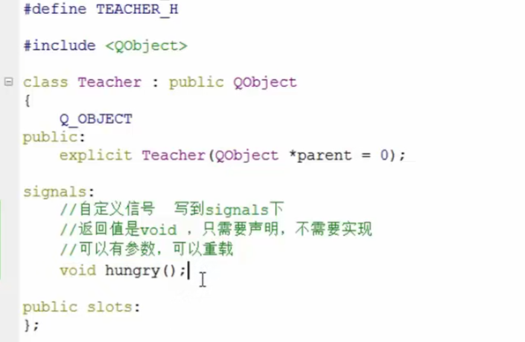
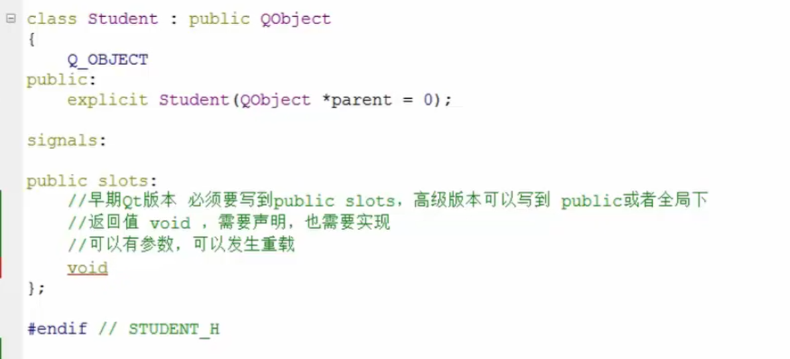
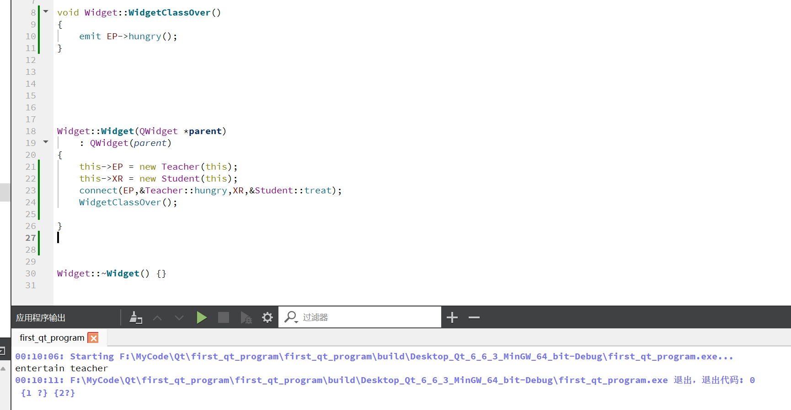
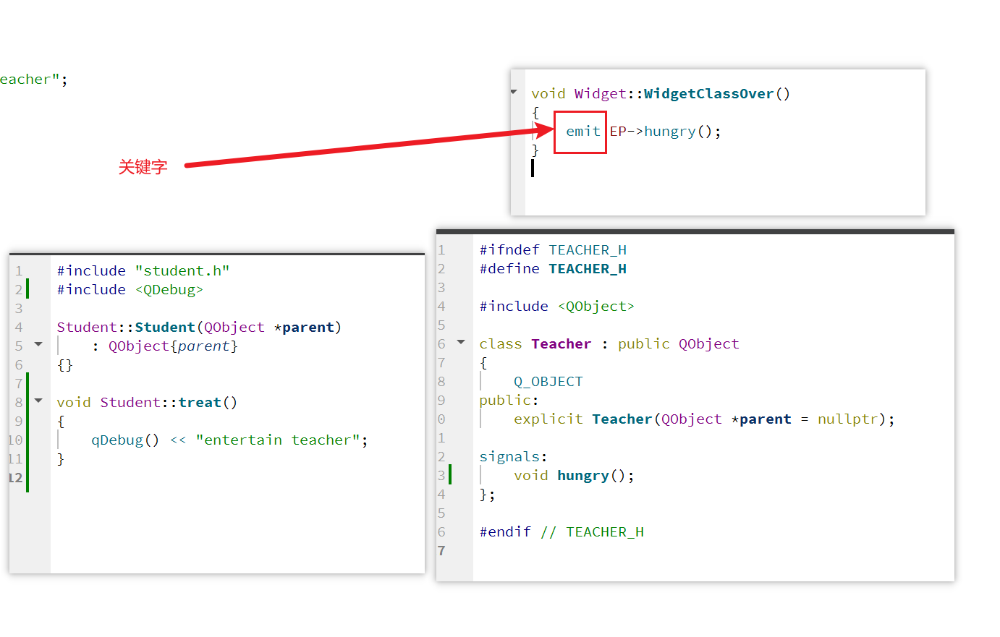

# QT学习笔记

> Qt的界面里面有示例功能，可以作为参考学习使用

## 界面解析


## 项目创建

- 编译系统，可以选择编译器


- 类信息配置


类信息的配置可以帮助我们直接生成一个对应的代码框架与配置头文件

可以配置的三个类信息

`QWidget QMainWindow QDiaglog`

其中，`Qwidget`为父类，会提供一个最基本的页面

它的两个子类分别会有以下作用:

- `QMainWindow`：生成一个基础界面，涵盖选项框、工具栏、状态栏等等，以我们的QT编辑器为参考，有如下图：

  

- `QDiaglog`：如名称所示，会生成一个基础的对话框，涵盖对话按钮等，以我们的QT界面为参考，有如下图：

  

图中的`Generate form`选项，可以创建一个基础的界面，可以在QT的设计界面中使用拖拽的方式来创建UI


### Qt基本模块


### Qt快捷键


##  API介绍

### 信号槽

信号槽的创建使用`connect`函数

`#include <QObject>`

```
QMetaObject::Connection QObject::connect	\
	(const QObject *sender, const char *signal, const QObject *receiver, const char *method,	\
    Qt::ConnectionType type = Qt::AutoConnection)
```

实际使用起来如下

```
QObject::connect(btn,&QPushButton::clicked,this,&Widget::close);
```

其中btn为控件指针，this为接收者指针

另外两个参数为信号，需要传递指针过去

### 按钮控件

`#include <QPushButton>`


## 对象树

对象树用于管理Qt窗口各个控件的生命周期，当我们结束程序的时候，各个控件的指针会依次从最底层开始进行析构释放


注意此处是对象树，而非继承树，因此哪怕不是继承自父对象的类，也可以添加进这个对象树中

只要是继承自QObject的子类即可，因此在Qt中，尽量在构造的时候指定parent对象，并且大胆在堆上创建

## 信号和槽

以创建按钮关闭窗口的需求为例

```
flowchart LR
	Button --Click-->Window-->Close
```

而这里的例子可以拟合成如下步骤

```
flowchart LR
	SignalSender--Signal-->SignalAccepter-->SignalProc
```

这里的`SignalProc`就是`信号槽`，**具体创建与实现可以查看API调用部分**

> [!NOTE]
>
> 信号槽的优点可以综合为以下几点：
>
> - 松散耦合
> - 发送端与接收端本身没有关联，通过`connect`将两端耦合在一起

### 自定义的信号和槽

创建一个新的类之后，会在头文件出现以下内容：

其中信号的创建如下：



槽的创建有如下要求：



**信号的触发**：

触发信号需要调用对应函数，这里可以这样实现：





也就是**使用关键字`emit`触发对应信号**


## C/C++


### 静态成员与非静态成员

静态成员可以理解为类似全局函数的东西，只不过为了管理方便我们将其划分到了类里面

它并不依赖类的实例创建，**不论你这个类创建了多少个，被多少个子类继承，静态成员永远就只有那一个**。

#### 成员

| 特性                     | 静态成员                                       | 非静态成员                                     |
| ------------------------ | ---------------------------------------------- | ---------------------------------------------- |
| 是否属于具体对象         | 否（属于类本身）                               | 是（属于具体对象）                             |
| 内存分配                 | 类级别，全局唯一                               | 对象级别，每个对象都有自己的副本               |
| 访问方式                 | 通过类名或对象访问（推荐类名访问）             | 必须通过对象访问                               |
| 生命周期                 | 随类的生命周期（类加载时创建，程序结束时销毁） | 随对象的生命周期（对象创建时存在，销毁时结束） |
| 是否共享                 | 所有对象共享同一份                             | 每个对象拥有独立的一份                         |
| 能否被静态成员函数访问   | 可以                                           | 不可以                                         |
| 能否被非静态成员函数访问 | 可以                                           | 可以                                           |


#### 成员函数

| 特性               | 静态成员函数                           | 非静态成员函数               |
| ------------------ | -------------------------------------- | ---------------------------- |
| 是否依赖对象       | 不依赖（属于类本身）                   | 依赖（属于类的具体对象）     |
| 调用方式           | 通过类名直接调用 `AClass::Function();` | 通过对象调用 `A.Function();` |
| 能否访问静态成员   | 可以                                   | 可以                         |
| 能否访问非静态成员 | 不可以                                 | 可以                         |
| 是否有 `this` 指针 | 没有                                   | 有                           |
| 内存分配           | 类级别，全局唯一                       | 对象级别，不同对象独立       |

简单来讲，静态成员函数类似我们普通定义的函数，只是为了扩展我们将其定义到了类里面，其使用方式、各方面特性都与普通函数类似

> [!NOTE]
>
> 比较特殊的是静态成员函数只能访问类中的静态成员，这也是合理的，因为我们可以在没有实例的情况下调用该函数，实例都没有，那里面的变量也没有初始化，如何访问。


## 类的权限与封装性

在C++中，类的权限控制主要有三种：`public`、`protected` 和 `private`，它们定义了类成员（包括成员变量和成员函数）的可访问性。这种设计旨在提供数据封装和继承的灵活性，确保代码的安全性、可维护性以及灵活性。以下是对这三种访问权限的详细说明及其使用区别：

### 1. `public` 权限

- **说明**：`public` 成员可以在类的内部和外部访问。换句话说，任何代码都可以直接访问类的 `public` 成员（包括其他类的对象或函数）。

- 使用场景

  ：

  - 适合那些需要对外公开的接口，如构造函数、`getter` 和 `setter` 方法，以及一些用户需要直接调用的成员函数。
  - 不推荐将成员变量声明为 `public`，因为这会破坏类的封装性和数据安全性。

- **设计意图**：`public` 权限是为了提供类的接口和功能，使外部代码可以与类进行交互。

```
cpp复制代码class MyClass {
public:
    int publicVar;  // 公有成员变量
    void publicMethod();  // 公有成员函数
};
```

### 2. `protected` 权限

- **说明**：`protected` 成员可以在类的内部和子类中访问，但不能在类的外部访问。即使是类的对象或其他非继承的类也无法访问它。

- 使用场景

  ：

  - 适合那些希望在子类中使用但不希望被外部访问的成员变量或方法。通常在类的继承关系中，用于子类需要访问的父类数据。
  - 例如，父类可能有一些辅助函数或内部状态，子类需要访问这些信息来实现特定功能，但外部不应直接操作这些数据。

- **设计意图**：`protected` 使得类的继承结构更加灵活，允许子类在继承父类的同时保留对某些成员的访问权，但又避免了外部代码直接访问这些成员，从而保护数据的完整性。

```
cpp复制代码class BaseClass {
protected:
    int protectedVar;  // 受保护的成员变量
};

class DerivedClass : public BaseClass {
public:
    void accessProtectedVar() {
        protectedVar = 10;  // 在子类中访问受保护的成员
    }
};
```

### 3. `private` 权限

- **说明**：`private` 成员只能在类的内部访问，外部代码或子类都无法直接访问它们。这是访问限制最严格的一种。

- 使用场景

  ：

  - 适用于那些仅限类内部使用的成员，例如内部状态、辅助函数或敏感数据。这些数据和函数不希望被外部直接访问或修改，因此设置为 `private` 以确保类的安全性和完整性。
  - 通过 `private`，类可以对外界隐藏实现细节，只有通过 `public` 方法（接口）才能访问或修改这些数据。

- **设计意图**：`private` 权限是为了实现封装（Encapsulation），将数据和操作封装在类内部，防止外部代码随意修改数据的状态，确保数据的一致性和安全性。

```
cpp复制代码class MyClass {
private:
    int privateVar;  // 私有成员变量

public:
    void setPrivateVar(int value) {  // 公有方法来访问私有成员
        privateVar = value;
    }
};
```

### **4.总结**

不论是哪一种权限，在定义的类内部进行实现都是可以直接调用的，不需要使用`this->function`或者`this->var`的方式，不过要使用也可以。

对于`public`里面的成员和函数，可以理解成这个类创建实例后，提供给外部接口使用的。

`private`和`protected`的区别其实就在于`private`只能由类内部的函数进行调用，而`protected`为子类也提供了调用的接口。

这种类的实现和创建其实应该是为了我们的封装更加方便来进行的，最后提供给外部的API应该是一个子类，而重要的部分经过层层封装写入在`private`里面，防止了数据篡改的发生


