# QT学习笔记

> Qt的界面里面有示例功能，可以作为参考学习使用

## 界面解析

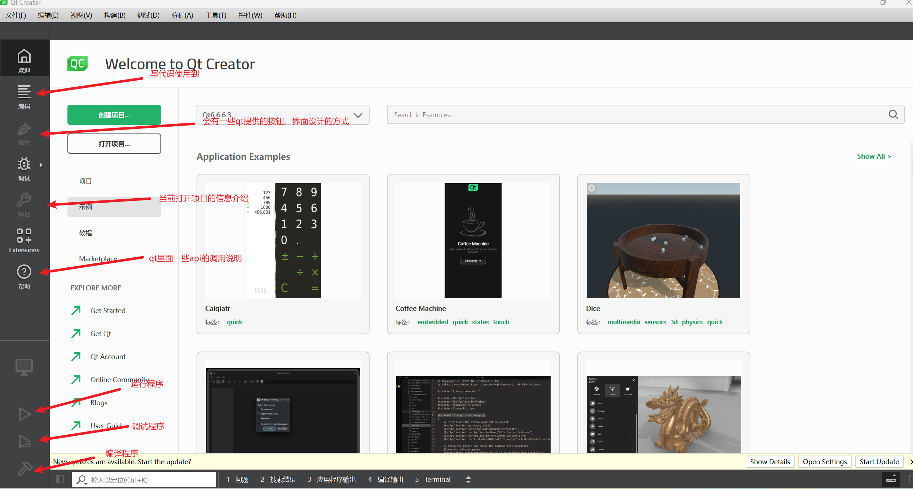

## 项目创建

- 编译系统，可以选择编译器

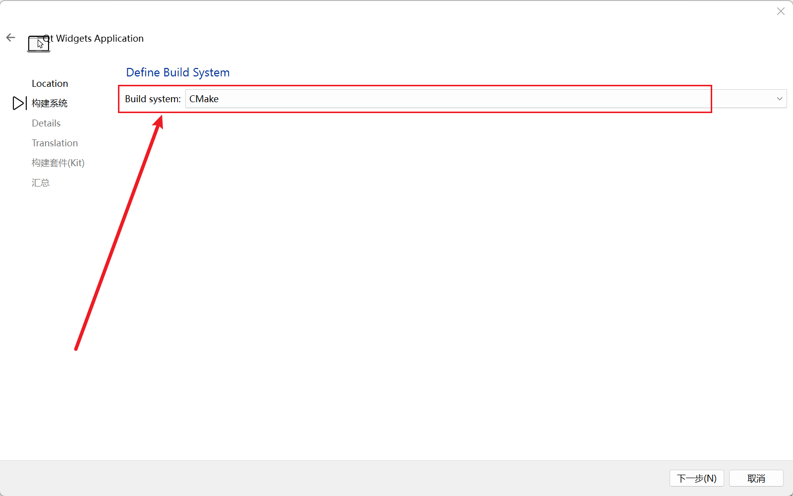

- 类信息配置

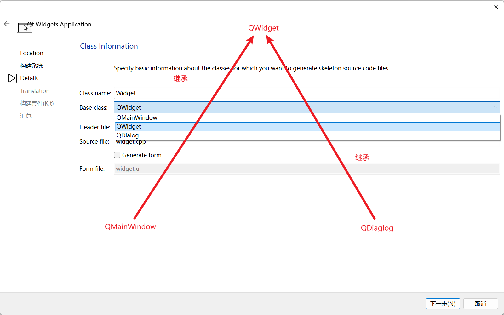

类信息的配置可以帮助我们直接生成一个对应的代码框架与配置头文件

可以配置的三个类信息

`QWidget QMainWindow QDiaglog`

其中，`Qwidget`为父类，会提供一个最基本的页面

它的两个子类分别会有以下作用:

- `QMainWindow`：生成一个基础界面，涵盖选项框、工具栏、状态栏等等，以我们的QT编辑器为参考，有如下图：

  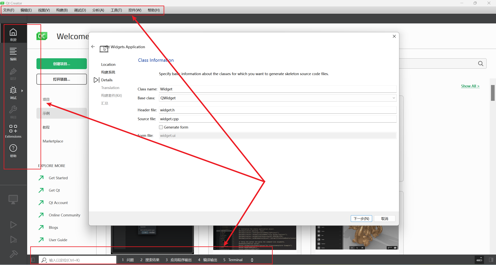

- `QDiaglog`：如名称所示，会生成一个基础的对话框，涵盖对话按钮等，以我们的QT界面为参考，有如下图：

  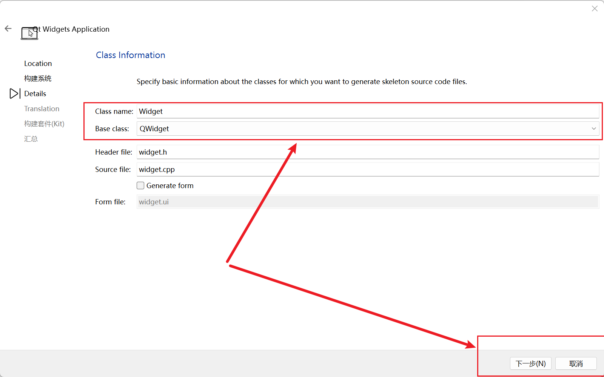

图中的`Generate form`选项，可以创建一个基础的界面，可以在QT的设计界面中使用拖拽的方式来创建UI

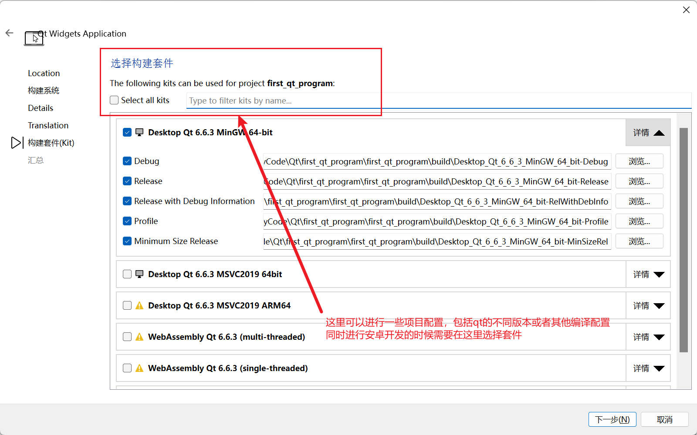

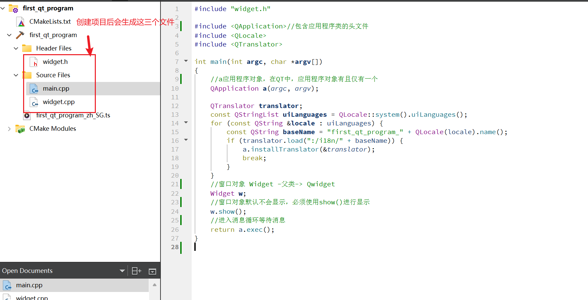

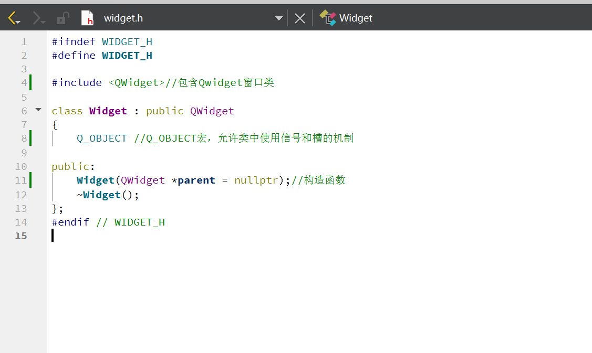

### Qt基本模块

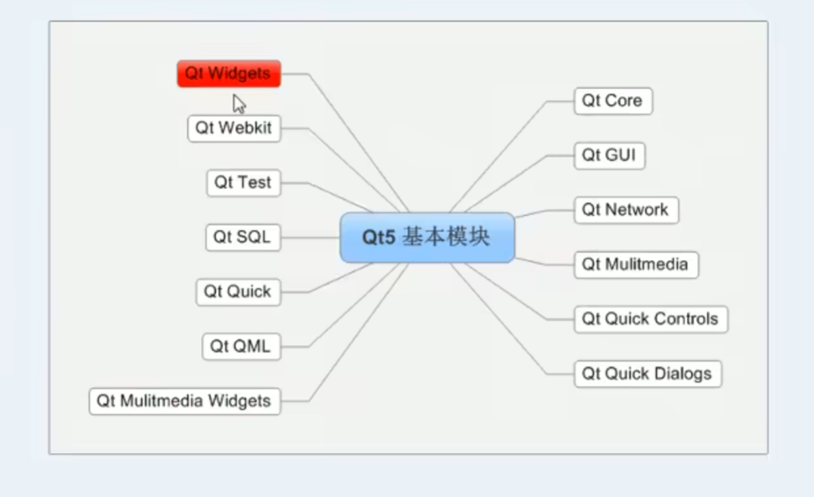

### Qt快捷键

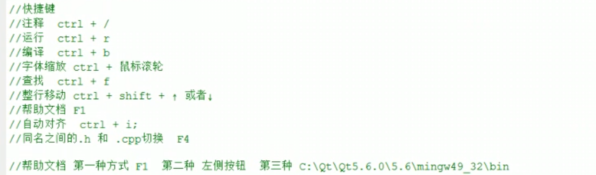

##  API介绍

### 按钮控件

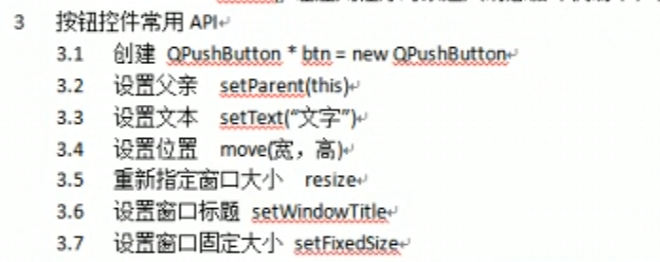

## 对象树

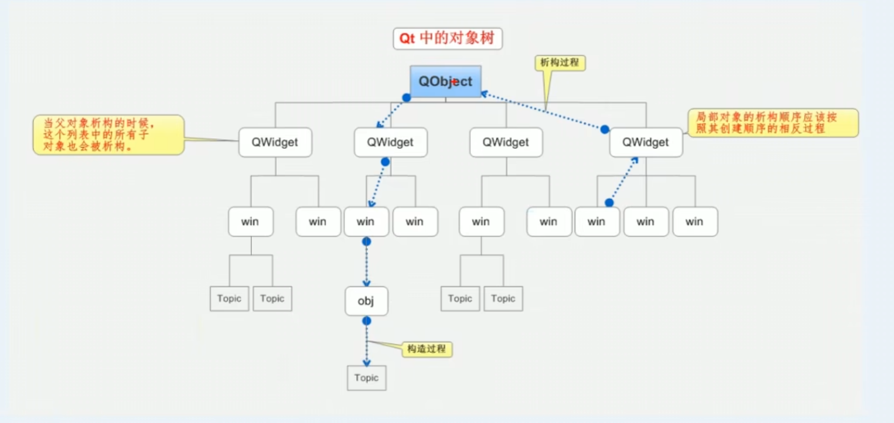

注意此处是对象树，而非继承树，因此哪怕不是继承自父对象的类，也可以添加进这个对象树中

只要是继承自QObject的子类即可，因此在Qt中，尽量在构造的时候指定parent对象，并且大胆在堆上创建

