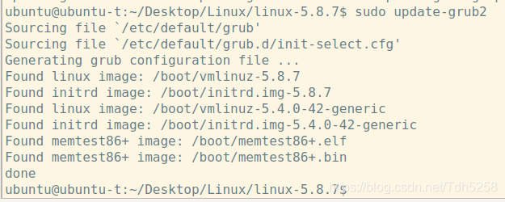
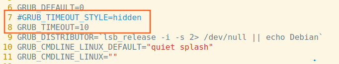

## `Linux`内核源码下载编译

这部分内容为`GPT`生成，暂时未进行实践，待完善

### `Linux`内核源码下载

- 更新系统并下载编译依赖项

  - ```
    #更新软件包的本地索引，即软件包列表。它从你系统配置的所有软件源（也称为存储库）中获取最新的软件包信息。
    sudo apt update
    #实际执行软件包的更新操作。它会基于 sudo apt update 获取的最新包索引，升级系统中已经安装的软件包到它们的最新版本。
    sudo apt upgrade
    #安装内核编译需要的依赖项
    sudo apt install build-essential libncurses-dev bison flex libssl-dev libelf-dev
    ```

  - 依赖项各自的作用
    - `build-essential`
      - **功能**: 包含了一组用于编译软件的基本工具，包括 `gcc`（GNU C 编译器）、`g++`（GNU C++ 编译器）、`make`、`dpkg-dev` 等。
      - **用途**: 在编译内核和其他软件时提供基础的编译工具。
    - `libncurses-dev`
      - **功能**: 提供 `ncurses` 库的开发头文件。`ncurses` 是一个用于在终端中创建文本界面（`TUI`）的库。
      - **用途**: 在配置内核时（例如使用 `make menuconfig`）会用到 `ncurses` 库来生成用户友好的菜单界面。
    - `bison`
      - **功能**: 一个语法分析器生成器（解析器生成器），通常用于从上下文无关文法生成语法解析器。
      - **用途**: 在编译过程中处理内核的各种代码生成任务，尤其是解析 C 语言中的复杂语法结构。
    - `flex`
      - **功能**: 一个词法分析器生成器，它用于从词法分析规则生成词法解析器。
      - **用途**: 与 `bison` 一起使用，用于处理内核代码中的词法分析阶段。
    - `libssl-dev`
      - **功能**: 提供用于加密操作的 `OpenSSL `库的开发头文件。`libssl` 是 `OpenSSL `的库，广泛用于加密、`SSL/TLS` 通信等。
      - **用途**: 在编译内核时，某些加密模块或功能（例如内核中对 `SSL/TLS` 的支持）需要这个库。
    - `libelf-dev`
      - **功能**: 提供 `ELF（Executable and Linkable Format）` 文件格式的开发库和头文件。`ELF` 是 `Linux` 系统上可执行文件、共享库和目标文件的标准格式。
      - **用途**: 内核在编译过程中需要处理 `ELF` 文件，尤其是在生成内核模块和处理相关调试信息时。

这些依赖项负责提供编译内核时所需的基础工具和库支持。`build-essential` 提供了基本的编译器工具链，`libncurses-dev` 用于生成内核配置菜单，`bison` 和 `flex` 是用于生成语法和词法解析器的工具，而 `libssl-dev` 和 `libelf-dev` 分别提供加密支持和 `ELF `文件格式支持。


-------------------------------------

这里更新的时候出现过一个问题：

```
study@study-virtual-machine:~/code$ sudo apt upgrade
正在等待缓存锁：无法获得锁 /var/lib/dpkg/lock-frontend。锁正由进程 3701（unattended-upgr）持有... 13秒
```

无法获取该缓存锁，这个进程一直运行没有结束

这里通过查阅发现该进程为`sudo apt update`命令执行后的后台更新进程，一般等待几分钟可以让其完成更新，之后就会释放缓存锁了

这里使用命令`ps aux | grep -i unattended-upgr`查看进程是否正在运行

发现长时间没有结束后选择直接杀死进程：

`sudo kill -9 3701`

之后再次运行`sudo upgrade`没有再出现缓存锁无法获取的问题

关于杀死进程可以使用的几个`Shell`命令:

```
1- kill
kill命令的使用一般要搭配PID进行，此处可以使用
ps aux | grep process_name
获取pid号
用法：kill PID
有时候会遇到该进程是系统某些比较重要的组件的情况，这时候如果想杀死该进程可以使用
kill -9 PID
强制杀死进程

2- killall
killall命令可以杀死所有包含指定名称的进程
用法:killall process_name

3- pkill
pkill与killall类似，可以根据进程的名称杀死进程
用法: pkill process_name
```


-----------------------------------------------


- 使用`git`拉取`linux`内核源码：`git clone https://git.kernel.org/pub/scm/linux/kernel/git/torvalds/linux.git`


### 编译

#### 配置内核模块

使用当前系统配置作为基础进行选择

```
cp /boot/config-$(uname -r) .config
make olddefconfig
```

-----------------

以上命令执行后会出现问题，即`linux/debian`目录下找不到相关证书文件，经过查看发现，这部分证书文件只有`linux`发行版本会用到，而`git`拉取的源码中，并不需要用到证书，因此没有`debian`目录

执行`make olddefconfig`命令后，这些证书的相关编译配置并没有关闭，因此需要手动调整

- 打开`.config`文件
- 搜索以下几项并将其调整为对应数值：

```
CONFIG_SYSTEM_TRUSTED_KEYS=""
CONFIG_SYSTEM_REVOCATION_KEYS=""
CONFIG_MODULE_SIG=n
```

- 保存写入后需要再次执行`make olddefconfig`进行配置

---------------------------------------

##### 手动配置内核模块

```
#如果有一些内核模块需要定制化的，就执行以下命令进行配置
make menuconfig
```

#### 编译内核模块

##### 清理工程文件

- 执行`make mrproper`
  - 此操作会将历史编译过程中配置的内核功能配置文件清除掉，只有第一次执行内核编译前才进行此操作

- 执行`make clean`
  - 此命令仅删除编译过程产生的中间文件和目标文件，而不会删除历史配置

##### 编译内核

```
#-j$(nproc) 命令会根据你的 CPU 核心数并行编译，加快编译速度。$(nproc) 会返回你的 CPU 核心数。
make bzImage -j$(nproc)
```

-----

`make bzImage` 是用于编译 `Linux` 内核的一个常用命令，它的作用是生成压缩后的内核镜像 (`bzImage`)，该镜像可以用于引导系统。`bzImage` 是 `big zImage` 的缩写，意味着这是一个支持更大内核的压缩版本，通常用于 `x86` 架构。

-----

编译完成后可以使用以下命令

`sudo make install`

将内核安装至系统中运行

安装完成后可以重启使用`uname -r`查看内核版本是否与你安装的一致

若是不一致可以尝试手动更新引导程序

```
sudo update-grub
```

##### 编译内核模块

```
 make modules
```

编译后安装内核模块：

```
make modules_install
```

##### 编译命令`make`的用法

`make`命令会根据当前文件夹下的`makefile`文件执行编译动作

这里我们默认工作目录为`linux`

这个目录下执行`make`之后，会根据`.config`文件的配置内容执行编译

而如果我们在`make`后面加了参数（如`make modules、make bzImage`）就会编译对应的部分项目

此处有几个`make`命令的常用用法：

```
#清理编译过程中产生的中间文件和对象文件，但是不会清除历史配置
make clean
#清理编译过程中产生的文件，对比make clean更加彻底，会将目录恢复到未进行编译的状态
make mrproper
#编译内核
make bzImage
#编译内核模块
make modules_install
#全编
make all
#将编译好的内核安装到对应目录
make install
```

#### 配置开机启动项

修改 `Ubuntu` 操作系统的默认启动项，使系统重启后进入新编译的`linux-5.8.7`内核。

1、输入下列命令将内核作为引导，将数字更改为自己编译的版本号

      sudo update-initramfs -c -k 5.8.7

2、更新启动项列表

      update-grub2



3、修改默认启动菜单的配置文件

      sudo vim /etc/default/grub

注释` GRUP_TIMEOUT_STYLE=hidden` 列。
       修改 `GRUB_TIMEOUT 的值`为10 。（可修改为其它数值）

   `GTUB_DEFAULT`=0，表示从第一个内核启动（`linux-5.8.7`位于第一个）。



保存修改，重启系统，可看到启动菜单项。选择advanced，进入后选择刚编译安装好的内核进入即可。


进入后确认内核版本是否正确：`uname -r`


### 问题


#### 缺少工具`pahole`导致无法生成`BTF`信息

```
BTF: .tmp_vmlinux1: pahole (pahole) is not available
Failed to generate BTF for vmlinux
Try to disable CONFIG_DEBUG_INFO_BTF
make[2]: *** [scripts/Makefile.vmlinux:34: vmlinux] Error 1
make[1]: *** [/home/ubuntu-20/code/linux/Makefile:1157: vmlinux] Error 2
make: *** [Makefile:224: __sub-make] Error 2
```

出现的错误提示表明在编译` Linux `内核时，`pahole` 工具不可用，导致无法生成` BTF（BPF Type Format）`信息，从而导致编译失败。`BTF `信息是调试和 `BPF `程序所需的，通常用于` eBPF` 系统。

解决方式：安装对应工具即可

```
sudo apt-get update
sudo apt-get install dwarves
```

#### 缺少压缩工具`zstd`导致编译失败

```
ZSTD22  arch/x86/boot/compressed/vmlinux.bin.zst
/bin/sh: 1: zstd: not found
make[3]: *** [arch/x86/boot/compressed/Makefile:139: arch/x86/boot/compressed/vmlinux.bin.zst] Error 127
make[3]: *** Deleting file 'arch/x86/boot/compressed/vmlinux.bin.zst'
make[3]: *** Waiting for unfinished jobs....
make[2]: *** [arch/x86/boot/Makefile:100: arch/x86/boot/compressed/vmlinux] Error 2
make[1]: *** [arch/x86/Makefile:302: bzImage] Error 2
make: *** [Makefile:224: __sub-make] Error 2
```

这个错误是因为系统中缺少 `zstd`（`Zstandard` 压缩工具），而内核编译过程需要使用 `zstd` 对文件进行压缩。

解决方式：安装工具即可

```
sudo apt-get update
sudo apt-get install zstd
```


