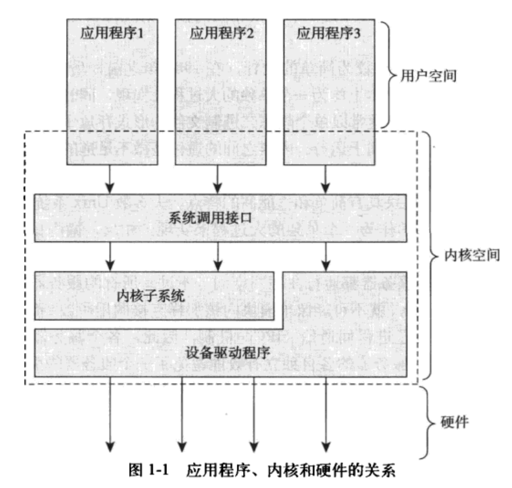

# Linux内核设计

## 操作系统与内核

操作系统是指在整个系统中负责完成最基本功能和系统管理的那些部分。

这些部分应该包括

- 内核
- 设备驱动程序
- 启动引导程序
- 命令行Shell或者其他种类的用户界面、基本的文件管理工具和系统工具

而这里我们的主题是**内核**，内核才是操作系统的内在核心。

系统其他部分必须依靠内核这部分软件提供的服务，像管理硬件设备、分配系统资源等。

通常一个内核有以下几个部分共同组成

- 负责响应中断的中断服务程序
- 负责管理多个进程从而分享处理器时间的调度程序
- 负责管理进程地址空间的内存管理程序和网络
- 进程间通信等系统服务程序

内核独立于普通的应用程序，处于系统态，拥有受保护的内存空间和访问硬件设备的所有权限。

这种系统态和被保护起来的内存空间统称为**内核空间**

相对的，应用程序只能在**用户空间**执行，他们只能看到允许他们使用的部分系统资源，并且只是用某些特定的系统功能，不能直接访问硬件，也不能访问内核划给别人的内存范围。

应用程序会通过系统调用来与内核进行通信，通常是调用库函数再由库函数通过系统调用界面，来让内核完成各种不同的任务。

有些比较复杂的库函数，内核的操作只是其中一部分，例如`printf()`，他还提供了数据的缓冲与格式化操作。

当一个应用程序执行一条系统调用，我们说**应用程序通过系统调用在内核空间运行**

而内核则称为运行于**进程上下文**中

内核还需要管理硬件设备，当硬件设备想要和系统通信的时候，就会发出一个中断信号(异步)打断处理器，之后处理器打断内核执行，内核会根据中断号调用对应的中断服务程序，以保证该设备的信息被及时处理。

以键盘输入为例，当我们敲击键盘时，键盘会发送一个信号给到处理器，处理器打断内核执行，内核根据中断号判断键盘缓冲区有数据到来，同时调用对应的中断程序。该程序处理数据后通知键盘可以继续输入程序了。

许多操作系统包括linux的中断都不在进程上下文中执行，它们在一个与所有进程无关的中断上下文中运行，以保证中断的响应和处理速度。

上图画出了整个系统运行的几乎所有情况：

- 运行于用户空间，执行用户进程
- 运行于内核空间，处于进程上下文，代表某个特定进程的执行
- 运行于内核空间，处于中断上下文，处理某个特定的中断。

当系统没有执行任何进程的时候，会运行一个空进程，处于进程上下文中，但运行于内核空间

### 单内核与微内核

操作系统内核可以大致分为两种，单内核与微内核

- 单内核是一种较为简单的设计，即将其整体上作为一个大过程来进行实现，同时也运行在一个单独的地址空间上。这样的内核之间的通信几乎没有开销，大家位于同一个地址空间中运行，内核可以直接调用函数，使用变量。
- 微内核是将内核的功能分为多个独立的模块，每个模块被叫做一个服务器，理想情况下，只有强烈请求特权服务的服务器会运行在特权模式下，其他服务器都会运行在用户空间中。每个服务器运行在各自单独的地址空间上，服务器之间用进程间(IPC)通信机制进行交互，这样的做法有效避免了某个服务器失效祸及另一个服务器，同时，模块化的系统允许一个服务器为了另一个服务器而换出。

> 由于IPC通信的开销过大，远大于函数调用，而且还会涉及到内核空间与用户空间的上下文切换，消息传递就会需要一定的周期，实际效率远低于单内核，因此到后来的微内核系统(windows XP、Windows7)都会将绝大多数的服务器放到内核空间中，甚至在更新的版本中几乎不让任何服务器运行在用户空间中。

而Linux系统属于单内核的操作系统，但是它也汲取了微内核操作系统的精华，实现了模块化设计、抢占式内核、支持内核线程以及动态装载内核模块的能力。

至今，Linux是模块化的、多线程的、内核本身可调度的操作系统。

