# 蜂窝`4G`

| 术语   | 解释                                                         |
| :----- | ------------------------------------------------------------ |
| PSTN   | PSTN（Public Switched Telephone Network，公共交换电话网络）是传统的电话网络，用于实现电话呼叫的连接和通信。 |
| CS域   | 在移动通信系统中，专门用于语音通话的部分，采用电路交换技术来建立和维护通话。PSTN是一个典型的CS域的例子，因为它通过建立专用的通信路径来实现通话。 |
| MSC    | MSC（Mobile Switching Center，移动交换中心）是移动通信系统中的关键组件，负责处理移动用户的呼叫和管理网络资源。 |
| EPC    | EPC（Evolved Packet Core，演进分组核心）是LTE（长期演进）网络架构中的核心组件，负责管理数据和信令流。EPC旨在提供高效、灵活的移动数据服务 |
| MME    | 负责用户设备的接入控制、移动性管理和信令处理。               |
| S-GW   | 在用户平面处理数据流量，负责数据包的路由和转发。             |
| P-GW   | 负责用户与外部数据网络的连接，处理IP地址分配和流量管理。     |
| HSS    | 存储用户订阅信息和身份验证数据。                             |
| PND    | 用于传输分组数据的网络。在移动通信中，PDN通常指与用户设备连接的外部数据网络，例如互联网或特定的企业网络。 |
| LTE    | Long Term Evolution，长期演进,是一种移动通信标准，旨在提供高速的数据传输和更好的网络性能。LTE是3G网络的演进，通常被视为4G技术的第一代。 |
| VoLTE  | VoLTE是指在LTE网络上直接进行语音通话的技术，使用IP分组交换而不是传统的电路交换。 |
| CSFB   | 当用户在LTE网络中拨打语音电话时，如果网络无法支持VoLTE，则会将呼叫回退到CS域。 |
| ISDN   | ISDN（Integrated Services Digital Network，综合业务数字网络）是一种国际通信标准，旨在通过公共电话网络提供数字化的语音、数据和视频服务。该技术设计的初衷是为了替代PSTN，但是最终并没能实现，而是与PSTN并行使用，也是一种逐渐被淘汰的技术 |
| PS域   | PS域是负责数据通信的网络域，采用分组交换技术，用于传输数据流量（如互联网数据、电子邮件、应用程序数据等）。分组交换（Packet Switching）技术将数据分成小的数据包进行传输，而不是像电路交换（CS域）那样建立专用的通信通道。这种方式使得网络资源能够更高效地共享。 |
| IMS域  | IMS域是一个基于**IP（互联网协议）**的架构，旨在提供多媒体通信服务，包括语音、视频、消息传递、视频会议等。它特别用于实现现代的语音服务（如VoIP、VoLTE），使语音服务也可以通过分组交换网络进行传输。 |
| MS     | Mobile Station，移动台，MS是早期移动通信（主要是2G和3G）中的术语，指代用户用于接入蜂窝网络的设备。MS一般包括**移动终端设备**（手机、调制解调器等）和**SIM卡**（存储用户身份和网络认证信息）。 |
| UE     | UE是更现代的术语，出现在LTE（4G）和5G网络中，指代所有能够接入移动网络的设备。与MS类似，UE包括**硬件终端**（智能手机、平板电脑、物联网设备等）和**SIM卡**或**USIM卡**（用于认证和身份识别）。 |
| NodeB  | 3G UMTS基站，主要处理无线信号，依赖RNC进行控制和管理         |
| eNodeB | 4G LTE基站，集成更多功能，直接与核心网（EPC）通信，支持更高的数据传输速率和更多的用户连接。 |
| 信令   | 在通信网络中，用于管理和控制通信过程的控制信息或消息。信令不传输实际的用户数据（如语音、视频或文件），而是用于建立、维护、监控和终止通信会话，确保通信顺利进行。信令在通信网络中的作用相当于“通信协调员”，它负责指引数据的传输过程，确保通话或数据连接的正常进行。 |

## 蜂窝移动通信的概念：

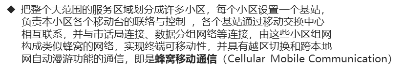

随着互联网网络的普及，蜂窝移动通信也开始支持与互联网等分组数据网络互联

### 三码信息与读取方式

这里的三码信息，一般（慧翰）指的是`IMSI、ICCID、IMEI`三个：

`IMSI`：国际移动用户识别码，相当于卡的网络身份证，一般预制在卡上，有一些特殊的卡会不提供`IMSI`号

>[!NOTE]
>
>现在的运营商基站兼容性较好，当你卡不提供`IMSI`的时候，也可以根据`IMEI`等其他信息进行附着驻网动作，联网后会分配一个临时移动用户识别码`TMSI`

读取方式：`AT+CIMI`

`ICCID`:集成电路卡识别码，相当于卡的身份证，用于识别`SIM`卡的身份信息

读取方式：`AT+ICCID`

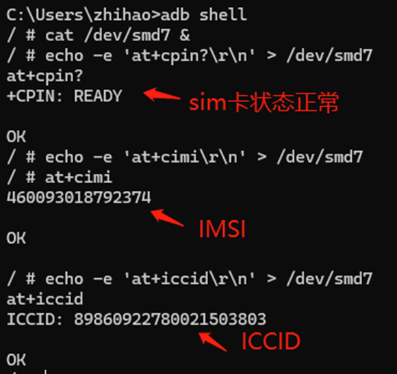

`IMEI`:国际移动台设备识别码，相当于模组设备的身份证，绑定我们的设备信息，防止设备被盗用

读取方式：`ATI`

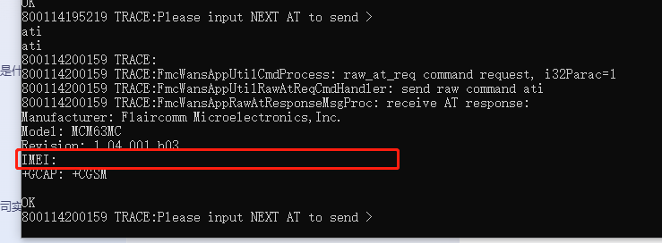

查看`SIM`的状态：`AT+CPIN?`

## 蜂窝通信构成

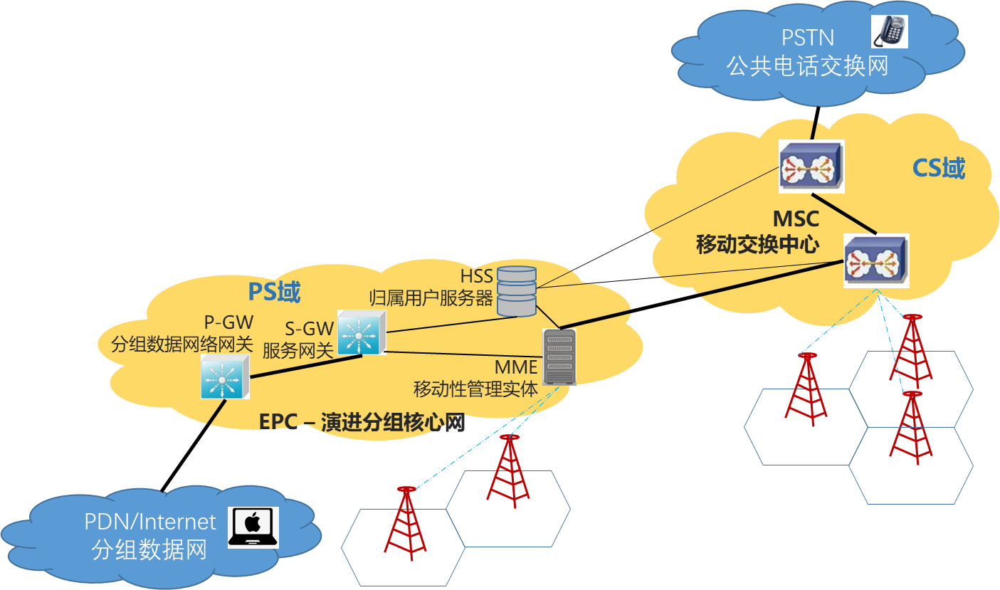

当在`2G/3G`网络下，移动设备呼叫另一个移动设备，会经过下列流程：

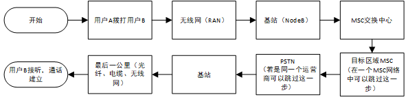

移动设备呼叫固定设备的话，会经过下列流程：
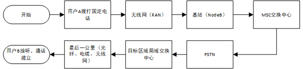

而如果是在`4G/5G`网络下，设备支持`VoLTE`通话：

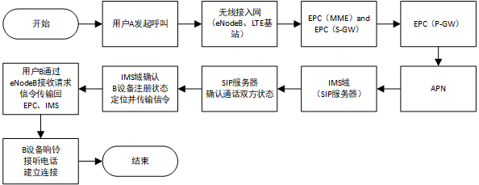

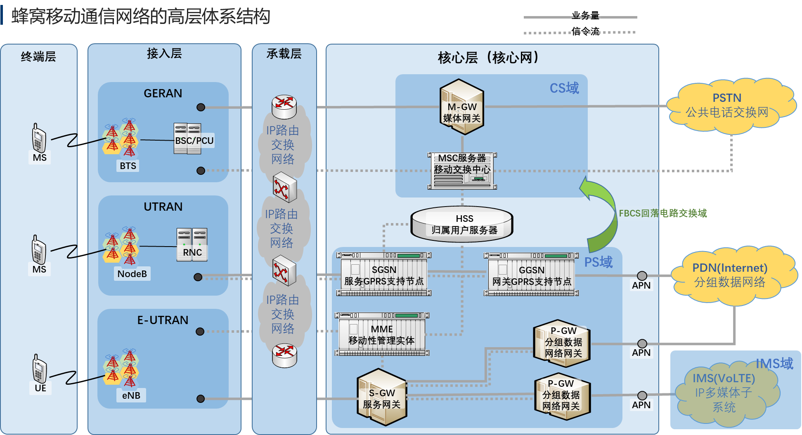

### 蜂窝移动通信网络的服务区域组成

蜂窝移动通信网络是现代移动通信技术的重要组成部分，其核心思想是通过将服务区域划分为多个小区，并利用频率复用技术来提高系统容量。

#### 宏蜂窝与微蜂窝

##### 宏蜂窝

宏蜂窝是蜂窝移动通信网络中的基本组成单元，主要用于大面积覆盖。其主要特点包括：

- **覆盖范围**：宏蜂窝的覆盖半径较大，通常为几百米到几十千米不等，具体取决于基站天线的发射功率、高度以及地形环境等因素。
- **发射功率**：宏蜂窝基站的发射功率相对较高，以确保信号能够覆盖到较远的区域。
- **应用场景**：宏蜂窝主要应用于城市、郊区等开阔地区，为大量用户提供基本的移动通信服务。

##### 微蜂窝

微蜂窝是在宏蜂窝的基础上发展起来的一种技术，主要用于解决宏蜂窝覆盖不到或信号质量不佳的区域。其主要特点包括：

- **覆盖范围**：微蜂窝的覆盖半径较小，通常为数十米到数百米不等，具体取决于基站天线的发射功率和安装位置等因素。
- **发射功率**：微蜂窝基站的发射功率较低，以减少对周围环境的干扰并节省能源。
- **应用场景**：微蜂窝主要应用于室内、隧道、地下停车场等宏蜂窝难以覆盖的区域，以及商业中心、体育场馆等高话务量区域，以提高信号覆盖质量和通信容量。

#### 大区制与小区制

##### 大区制

大区制是指一个基站覆盖整个服务区或较大的区域。其主要特点包括：

- **覆盖范围**：大区制的覆盖半径较大，通常为几十千米到几百千米不等，具体取决于基站天线的发射功率和高度等因素。
- **发射功率**：大区制基站的发射功率非常高，以确保信号能够覆盖到较远的区域。
- **优缺点**：大区制的优点是网络结构简单、投资少、见效快；缺点是覆盖范围有限、系统容量受限、频率利用率低，且难以提供高质量的移动通信服务。

##### 小区制

小区制是将整个服务区划分为若干个小区，每个小区设立一个基站负责该区域的移动通信服务。其主要特点包括：

- **覆盖范围**：每个小区的覆盖半径较小，通常为数百米到几千米不等，具体取决于基站天线的发射功率和安装位置等因素。
- **发射功率**：小区制基站的发射功率相对较低，以减少对周围环境的干扰并节省能源。
- **优缺点**：小区制的优点是提高了频率的利用率、减少了相互间的干扰、增加了系统容量；缺点是网络结构相对复杂、建设和维护成本较高。
- **频率复用**：小区制通过频率复用技术，使得相邻小区使用不同的频率组，而相隔一定距离的小区则可以使用相同的频率组，从而大大提高了频谱资源的利用率。

其实宏蜂窝与微蜂窝就包含在大区制与小区制里面了，可以以下面的比喻作为参考：

>想象一下，你所在的城市是一个巨大的快递配送区域，快递公司需要确保每个角落都能收到包裹。
>
>**大区制与小区制**
>
>1. **大区制**：就像快递公司最初只在整个城市设立了一个大型配送中心（相当于大区制基站），这个配送中心负责向整个城市发送和接收包裹。这样做的优点是简单、成本低，但缺点是如果城市很大，配送效率会下降，有些偏远地区可能等待时间较长。
>2. **小区制**：为了提高效率，快递公司决定在城市里划分多个小区，每个小区都设立一个小型配送站（相当于小区制基站）。这样，每个小区内的包裹配送就变得更快、更有效率。而且，通过合理的规划，不同小区可以使用相同的配送车辆（频率复用），从而节省了资源。
>
>**宏蜂窝与微蜂窝**
>
>1. **宏蜂窝**：在这个快递系统中，宏蜂窝就像那些大型配送中心，它们覆盖范围广，能够处理大量的包裹，是整个配送系统的基石。它们确保了城市的主要区域都能得到快速、有效的服务。
>2. **微蜂窝**：而微蜂窝则像是那些设立在小区内的小型配送站或者临时设立的快递柜。它们针对的是那些宏蜂窝难以覆盖或者服务不够细致的区域，比如高楼大厦的内部、地下停车场等。微蜂窝的存在，使得这些特殊区域也能享受到同样便捷、高效的快递服务。

### 信令

**信令（`Signaling`）**是指在通信网络中，用于管理和控制通信过程的控制信息或消息。信令不传输实际的用户数据（如语音、视频或文件），而是用于建立、维护、监控和终止通信会话，确保通信顺利进行。信令在通信网络中的作用相当于“通信协调员”，它负责指引数据的传输过程，确保通话或数据连接的正常进行。

**信令的主要功能**：

- 呼叫建立与终止：

  - 当用户A拨打电话时，信令用于通知网络发起呼叫请求，并与目标用户B设备确认状态，最后在用户B接听时建立通话。

  - 通话结束时，信令负责终止连接，释放网络资源。

  - 用户注册与认证：

  - 用户设备打开或进入网络时，信令负责处理设备的注册、身份认证（如通过`SIM`卡认证用户）、网络接入和分配资源等操作。

- 移动性管理：
  - 在移动通信中，信令用于管理用户的移动性，确保用户在切换基站（如从一个小区切换到另一个小区）时，通信不会中断。这是“切换”过程中的关键部分。

- 会话控制：
  - 在`IP`网络中（如`IMS`域），信令负责建立和管理多媒体会话，例如`VoLTE`语音通话、视频通话等。它控制会话的参数，如媒体的类型、质量等。

- 错误和异常处理：
  - 信令也用于检测和处理网络错误和异常状况。例如，如果某一通话无法建立，信令会发送错误消息给发起方。

**信令的类型**：

- 电路交换网络中的信令：
  - 在`2G、3G`等使用电路交换的网络中，信令通过专门的信令通道传输，用于建立和控制语音呼叫。例如，`SS7（Signaling System No. 7）`是传统`PSTN`和电路交换网络中的一种主要信令系统。

- 分组交换网络中的信令：
  - 在`4G LTE`和`5G`等分组交换网络中，信令通过`IP`协议进行传输。这里，信令通常通过`SIP（Session Initiation Protocol，会话初始协议）`实现，用于建立、管理和终止多媒体会话，如VoLTE中的语音通话。

- 无线网络中的信令：
  - 在移动通信网络中，信令通过无线信道传输，用于与基站（`NodeB、eNodeB`等）和核心网之间的通信。比如`LTE`中的`RRC`（`Radio Resource Control`，射频资源控制）信令，用于管理用户设备与网络之间的连接、切换等。

**信令与用户数据的区别**：

- 信令：控制信息或指令，用于建立和管理通信过程。例如，呼叫请求、连接确认、切换指令等。
- 用户数据：实际传输的数据，比如语音、视频、短信或互联网数据。

以手机打电话为例，信令在其中的作用如下：

1. **呼叫发起**：当用户A拨打用户B，手机发送信令请求到网络，表明要发起一个呼叫。
2. **呼叫路由**：信令通过网络设备（如基站、`MSC`、`IMS`服务器）将呼叫请求传递给用户B所在的网络。
3. **振铃**：用户B的设备收到呼叫信令，开始振铃，并通过信令响应网络，表明正在响铃。
4. **接听**：用户B接听电话后，信令告知网络接通，随后网络开始建立通话，语音数据通过相应通道传输。
5. **通话结束**：当用户A或B挂断电话时，信令通知网络释放资源并终止会话。

以上述例子所示，信令在我们蜂窝网络中，不传输实际信息，而是传递指令。

信令是移动通信和数据网络中不可或缺的控制机制，它确保连接的建立、维护、和结束，同时管理用户设备的状态和移动性。信令不会承载实际的数据流（如语音或视频），而是作为控制指令的传输载体。

## 蜂窝通信的`PLMN`与漫游原理

`PLMN`即公共陆地移动网络，每个`PLMN`都会有全球唯一的标识码：`PLMN ID = MCC（移动国家码）+ MNC（移动网络码）`组成

`PLMN`是一个国家或地区的电信运营商为公众提供陆地移动通信业务而建立和经营的网络。它与`PSTN`（公共交换电话网络）互联互通，形成整个地区或国家规模的通信网

二者最大的区别是`PLMN`为移动无线通信而`PSTN`是固定有线通话

### `PLMN`类型

`PLMN`的可以大致分为以下几类：

- 已登记`PLMN`（`Register PLMN`）：简称`RPLMN`

  `RPLMN`（`Register PLMN`已登记`PLMN`）：终端在上次开机或脱网前登记的`PLMN`，会临时保存在`USIM`卡上，在`3GPP` 2003年第`TSG TP`-21次会议上决定，将该参数从`USIM`卡上删掉，而将其保存在终端的内存中。

- 等效`PLMN`(`Equivalent PLMN`)：简称`EPLMN`

  - `EPLMN`是与`HPLMN`具有较高关联性、但优先级略低于`EHPLMN`的网络。它是被设备优先选择的网络之一，但其优先级低于`HPLMN`和`EHPLMN`。

- 归属`PLMN`(`Home PLMN`)：简称`HPLMN`

  - 其指代的是设备有限连接的公共陆地网络(`PLMN`)，这是设备的首选网络，通常由用户的SIM卡内存储的运营商网络信息决定
  - 如果设备检测到了多个`PLMN`，会优先选择`HPLMN`进行连接动作

- 等效本地`PLMN`（`Equivalent Home PLMN`）：简称`EHPLMN`

  - 为与终端当前所选择的`PLMN`处于同等地位的本地`PLMN`。其实：`EHPLMN`和`EPLMN`就好比是中移动的新建的158网络，而`PLMN`就好比是原来的135~139网络。`HPLMN`对应的运营商可能会有不同的号段，例如46000、46002、46007三个号段，46002相对46000就是`EHPLMN`;运营商烧卡时写入到`USIM`卡中。

- 用户控制`PLMN`（`User Controlled PLMN`）：简称`UPLMN`

  - 是终端在用户手动选网时选择的`PLMN`，`USIM`卡会存储下来。

- 运营商控制`PLMN`（`Operator Controlled PLMN`）：简称`OPLMN`

  - 运营商烧卡时将与该运营商签署了漫游协议的运营商`PLMN`作为`OPLMN`写入`USIM`卡，作为后面用户选网的建议。

- 禁用`PLMN`（`Forbidden PLMN`）：简称`FPLMN`

  - 为被禁止访问的`PLMN`，通常终端在尝试接入某个`PLMN`被拒绝（拒绝码11）以后，根据`3GPP`协议会将其加到本列表中。
  - 目前终端采用的`FPLMN`退出机制一般是设置为定时，即终端收到拒绝码后会将拒绝的`PLMN`加入禁用列表，但是这个加入可能会在一定时间后退出（一般是几小时或者十几个小时）

----------------------

- 访问`PLMN`（`Visited PLMN`）：简称`VPLMN`
  - 为终端用访问的`PLMN`。其`PLMN`和存在`SIM`卡中的`IMSI`的`MCC\MNC`是不完全相同的。当移动终端丢失覆盖后，一个`VPLMN`将被选择。
  - 简单来讲，`VPLMN`属于一个大类，只要你连接的`PLMN`是从网络中获取的，都可以归属于`VPLMN`

对于`UE`（终端设备）来说，一般在一个地区上，会有多个电信运营商，每个电信运营商又会部署多个`PLMN`网络，`UE`会根据`SIM`卡预置的`PLMN`信息选择`PLMN`进行搜网、网络附着、网络驻留。

### `PLMN`选网策略

`UE`在开机时，首先需要进行选网操作，即搜索并注册移动网络，在选网操作时分成`PLMN`选择和小区搜索过程，而`PLMN`选择是根据`UE`所维护的一些`PLMN`列表以及它们的优先级顺序进行择优选择与搜索

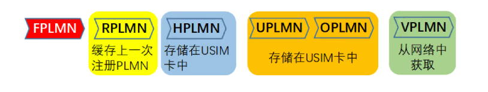

这里的`HPLMN`其实应该等价于`EHPLMN`列表，都存储在`USIM`卡当中

其中`VPLMN`中，会获取到一个`EPLMN`列表（`add by HSS`服务器），这个列表里面会包含一些拥有较高优先级的`PLMN`，可能是与归属运营商有进行漫游签约的运营商频段

### `UE`连接`VPLMN`过程

下图为`UE`连接一个`VPLMN`的过程图：

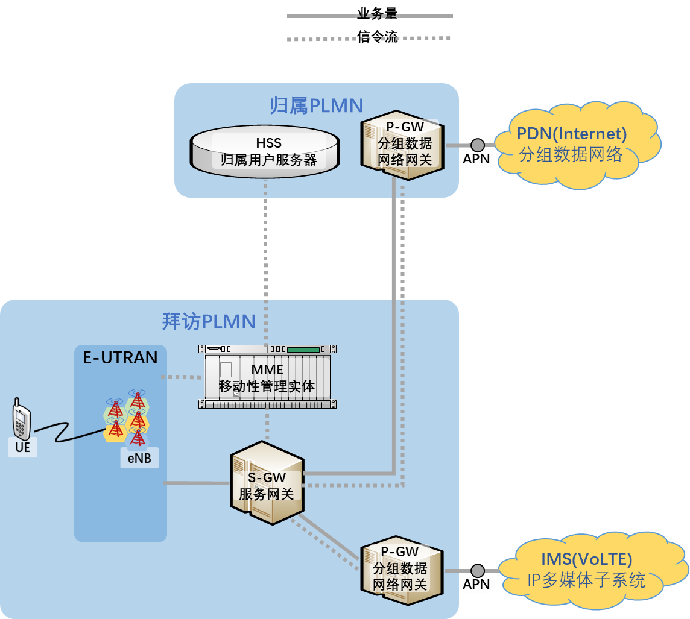

即`UE`通过`E-UTRAN`向`MME`发送信令请求驻网，此时`MME`识别到这是一个外部归属的驻网请求，就会向其归属`HPLMN`发送信令（包含`UE`的标识），请求`HPLMN`的`HSS`进行鉴权，`HSS`在收到请求后会根据标识寻找对应数据，然后返回。

这些数据通过信令流在`VPLMN`与`HPLMN`之间传递，是不可或缺的一部分。

## 移动终端接入无线网络的过程

移动终端所处的位置通常会有多个不同的移动无线网络覆盖，即移动终端会通过广播感知到多个`PLMN`，移动终端通过所维护的`PLMN`列表及其优先级选择对应的`PLMN`网络

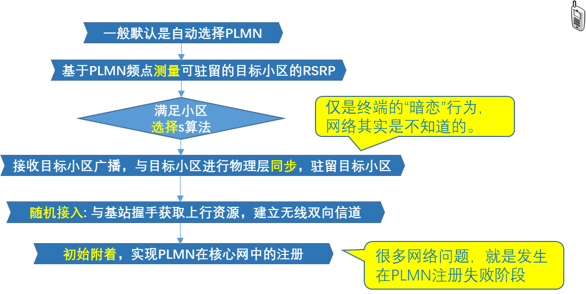

如上图所示，终端选择完`PLMN`之后会进行以下步骤：

1. 扫描该`PLMN`下不同频点的信号强度，特别关注可能作为驻留目标的小区的参考信号接收功率`RSRP`，这个数值是衡量`LTE`网络中信号强度的重要指标
2. 在测量了多个小区的相关信号指标后，终端会利用S算法（一种综合考虑信号质量、网络负载、终端能力等多种因素的小区选择算法）来筛选出最适合当前环境的小区进行驻留
3. 选择完小区后，设备会开始根据广播的信号中的信息，与对应小区的基站进行频率和时间上的同步
4. 进行随机接入，与基站握手获取上行资源，从而可以实现双向的通信
5. 执行附着

### 随机接入

随机接入的主要目的是：

- 建立上行链路
- 分配唯一终端标识（如`C-RNTI`）
- 请求网络分配给终端上行链路资源

随机接入可以分为竞争性随机接入与非竞争性随机接入两种方式，具体选择哪种方式取决于网络配置和接入场景。

#### 竞争性随机接入

竞争性随机接入过程主要包括以下四个步骤：

- `UE`发送随机接入前导码`MSG1`：该前导码从一组预定义的前导码中随机进行选择
- 基站发送随机接入响应`MSG2`：基站检测到前导码后发送随机接入响应。该消息中包含了定时提前量（`TA`）、上行授权（`UL grant`）和临时`CRNTI`（`TC-RNTI`）等信息。
- `UE`发送`RRC`连接请求`MSG3`：`UE`在接收到随机接入响应后，会根据上行授权在物理上行共享信道`PUSCH`上发送`RRC`连接请求消息。
- `UE`接收`RRC`连接建立`MSG4`：基站处理`RRC`连接请求后，会向`UE`发送`RRC`连接建立消息。如果多个`UE`使用了相同的前导码，基站将通过竞争解决过程确定哪个`UE`接入成功。

##### **竞争解决**：

基站响应

基站处理多个`MSG3`后，会选择一个`UE`进行确认，并通过`MSG4`发送竞争解决消息。

对于初始接入和重建场景，`MSG`中的`MAC PDU`会携带竞争解决标识；对于其他常见，`MSG4`可能不含`UE`竞争解决标识

`UE`判断：

`UE`通过比对`MSG3`和`MSG4`中的标识来判断竞争是否成功。如果`UE`的标识被基站确认，则会继续后续的信令流程进行附着等操作，竞争失败则会重试随机接入过程。

#### 非竞争性随机接入

- 网络侧分配专用前导码
  - 在需要进行非竞争随机接入的场景下（如切换、RRC连接状态下的定位过程等），网络侧会通过专用信令向UE分配一个专用的前导码。
- UE发送专用前导码
  - UE在PRACH上发送网络侧分配的专用前导码。
- 基站发送随机接入响应
  - 基站检测到专用前导码后，会发送随机接入响应消息。该消息中同样包含定时提前量、上行授权和临时CRNTI等信息。

非竞争性随机接入：

1. 网络侧分配专用前导码
   - 在需要进行非竞争随机接入的场景下（如切换、`RRC`连接状态下的定位过程等），网络侧会通过专用信令向`UE`分配一个专用的前导码。
2. `UE`发送专用前导码
   - `UE`在`PRACH`上发送网络侧分配的专用前导码。
3. 基站发送随机接入响应
   - 基站检测到专用前导码后，会发送随机接入响应消息。该消息中同样包含定时提前量、上行授权和临时`CRNTI`等信息。

### 执行附着

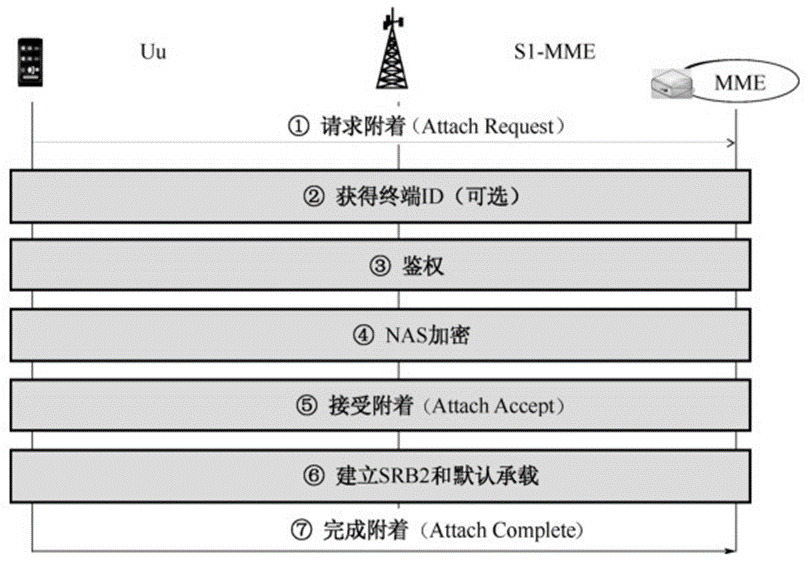

上图为附着的一个过程：

首先我们的终端设备UE会向基站发送附着请求并附带自己的一些信息，基站会将信息转发到MME，而后进行鉴权，鉴权的时候需要将终端的对应信息发送到归属地的HSS进行验证，验证对比通过后才会进行NAS加密，接收附着等流程。

以上流程初次附着会用到，而后续进行类似动作的时候将其称之为注网，就不需要发送敏感信息到HSS进行鉴权了，而是使用NAS加密的对应讯息进行鉴权动作，从而完成注网

> [!NOTE]
>
> 注网：设备之前已经附着过了，重新附着的时候使用
>
> 附着：初次与网络进行连接的时候使用

