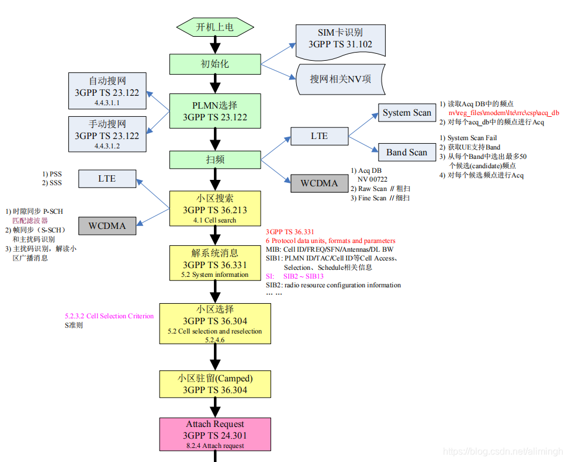
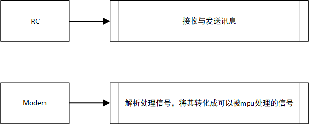
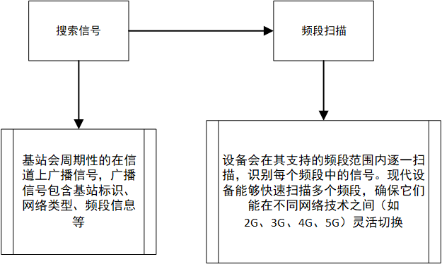
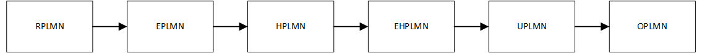
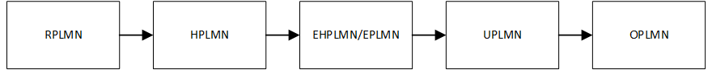

## LTE联网过程

待处理概念：

RSSI、BCCH、SCH、cell、信令、IMSI、3GPP TS xxxx、NV、PSS、SSS

`LTE`联网的过程大致如下：




### 设备搜索信号

移动设备（手机、平板等）会不断搜索附近的蜂窝基站信号。一旦找到信号强度足够的基站，它会尝试与其建立连接。

#### 初始化

##### 开启射频模块

开启射频模块（`RC`）与调制解调器（`Modem`）



#### 无线信号与频段扫描

设备启动后，射频模块会扫描不同的频段，以查找基站信号。

大致过程如图：



基站会周期性的广播信号，而我们的设备会在支持的频段范围内逐一扫描，然后选择一个网络。

#### 信号选择与基站识别

当设备扫描到基站广播的信号后，它会对接收到的信号进行分析和选择

设备在进行网络搜索时使用的策略涉及多个阶段，并且根据网络的覆盖情况、设备当前状态（如首次开机、闲置、或移动中）、以及当前网络环境的不同，策略会有所变化。

##### 首次开机或重启后的网络搜索策略

当设备首次开机或重启后，它会进行完整的网络搜索

- 优先本地网络
  - 设备会首先尝试连接最近一次成功连接的网络`RPLMN`（通常是本地运营商的网络），因为设备会在SIM卡中存储最近一次连接的网络信息（如`RPLMN`，公共陆地移动网络标识）。这一策略可以加速连接过程，因为设备不需要重新扫描所有的频段。
- 全频段扫描
  - 如果设备未能连接到之前的网络，它会启动全频段扫描。这一过程中，设备会在支持的所有频段（如`2G、3G、4G、5G`）内扫描蜂窝基站的信号。在每个频段中，设备会扫描广播信道（如`2G`的`BCCH`，`3G`的`SCH`，`4G`的`PSS/SSS`等），以找到可用的基站信号。这个过程可以是比较耗时的，因为需要逐个频段扫描并分析信号质量。
- `PLMN`选择
  - 在扫描到多个运营商网络时，设备会基于**`PLMN`选择策略**选择一个网络连接。
  - 设备上电之后会先尝试连接`RPLMN`
  - 之后扫描的时候若是搜索到了`HPLMN`与`EHPLMN`，则会切换到`HPLMN`或者`EHPLMN`
  - 若是上述都没有，则会尝试选择一个信号较好的基站进行连接
- 信号强度和质量优先
  - 设备会优先选择信号强度（`RSSI`）较高、质量（`SNR、RSRQ、RSRP`等）较好的基站进行连接。信号强度和质量由设备的无线模块不断测量和报告，设备会在多基站中选择最佳基站。

##### 移动状态下的网络搜索策略

当设备处于移动状态（例如用户在行走、乘车或火车上）时，网络搜索的策略会有所不同

- 领区扫描
  - 设备会不断扫描当前基站的"邻区"信号。这是为了在信号减弱时提前为设备寻找可用的下一个基站，以实现无缝切换。基站广播邻区信息，设备通过扫描这些信息来评估邻区基站的信号质量。
- 快速切换和重选
  - 在设备移动时，尤其是在高速移动环境下，设备的网络搜索策略会加快扫描频率，以快速识别新的可用基站。为了保证通信的连续性，设备会优先选择覆盖区域更广、信号更稳定的基站，并通过“硬切换”或“软切换”在不同基站之间无缝切换。
    - **硬切换（Hard Handover）**：设备在与一个基站断开连接后，才连接下一个基站。硬切换适用于低速移动或网络负载较高的场景。
    - **软切换（Soft Handover）**：设备可以同时连接多个基站，直到找到最佳信号的基站再断开其他连接。软切换常用于`3G`网络，能保证切换过程中信号不会中断。
- 重选频段
  - 移动设备不仅会在同一代网络中寻找基站，还会根据信号质量、负载等因素在不同代网络之间进行切换，例如从`4G`降到`3G`，或从`5G`切回`4G`。这种重选策略旨在确保通信的稳定性，尤其是在高负载区域或`5G`覆盖不足时，设备可以降级到更稳定的网络。

##### 闲置状态下的网络搜索策略

当设备进入闲置状态（即不主动进行数据传输时），它的网络搜索策略主要以节省能耗为主

- 间歇性扫描
  - 为了节省电量，设备不会持续搜索信号，而是间歇性地进行扫描。在信号良好的情况下，设备会降低扫描频率，以避免不必要的功耗。但如果信号强度下降，设备会增加扫描频率，确保能够及时发现更好的基站或网络。
- 小区重选（`Cell Reselection`）
  - 在闲置状态下，设备会根据信号强度、质量和运营商策略进行**小区重选**。小区重选主要是为了在设备静止或低速移动时优化信号质量。设备会根据各基站的优先级、信号强度和邻区基站的质量来选择最优的基站。
- 基于电量的网络选择
  - 现代设备为了进一步优化电量消耗，在低电量情况下可能会优先选择耗能较低的网络（如从`4G/5G`切换到`3G/2G`），因为较高代的网络通常需要更多的能量维持信号质量。

##### 国际漫游时的网络搜索策略

当设备在国际漫游时，它的网络搜索策略也会有所调整，以适应不同国家和地区的网络条件

- 优先漫游网络
  - 设备会先扫描本地运营商有漫游协议的网络，并优先选择这些网络进行连接。这是为了保证设备在国际漫游时能够使用最优的计费策略，并保证服务质量。
- 手动选择网络
  - 如果用户手动选择了特定的漫游网络，设备会按照用户选择的网络进行连接，而不再自动进行`PLMN`选择。这通常发生在用户希望避免高额漫游费用或选择特定的网络时。
- 网络不可用时的应急策略
  - 当设备在某些地区无法找到适用的漫游网络时，设备会保持周期性的网络扫描，等待网络可用。这时设备不会频繁切换网络，而是以较长的时间间隔进行低频扫描，以节省电量

##### `PLMN`选择策略详解：

关于`PLMN`的概念：`PLMN`（`Public Land Mobile Network`，公共陆地移动网络）是指由运营商提供的移动通信网络。PLMN的主要功能是为移动用户提供无线通信服务，包括语音通话、数据传输等。每个PLMN都有一个唯一的标识符，称为`MCC`（移动国家码）和`MNC`（移动网络码），二者结合形成`PLMN ID`，用于区分不同的网络。在全球范围内，`PLMN`是移动通信的基本构建单元，支持用户在不同地区和网络之间的漫游。

`PLMN`的可以大致分为以下几类：

```
PLMN ID:
	PLMN由PLMN ID唯一标识。
	PLMN ID由移动国家代码（MCC）和移动网络代码（MNC）组成，例如，中国移动的PLMN ID可能是46000，其中460是MCC，00是MNC。
```

- 已登记`PLMN`（`Register PLMN`）：简称`RPLMN`

    `RPLMN`（`Register PLMN`已登记`PLMN`）：终端在上次开机或脱网前登记的`PLMN`，会临时保存在`USIM`卡上，在`3GPP` 2003年第`TSG TP`-21次会议上决定，将该参数从`USIM`卡上删掉，而将其保存在终端的内存中。

- 等效`PLMN`(`Equivalent PLMN`)：简称`EPLMN`
  - `EPLMN`是与`HPLMN`具有较高关联性、但优先级略低于`EHPLMN`的网络。它是被设备优先选择的网络之一，但其优先级低于`HPLMN`和`EHPLMN`。
  
- 归属`PLMN`(`Home PLMN`)：简称`HPLMN`
  - 其指代的是设备有限连接的公共陆地网络(`PLMN`)，这是设备的首选网络，通常由用户的SIM卡内存储的运营商网络信息决定
  - 如果设备检测到了多个`PLMN`，会优先选择`HPLMN`进行连接动作
- 等效本地`PLMN`（`Equivalent Home PLMN`）：简称`EHPLMN`
  - 为与终端当前所选择的`PLMN`处于同等地位的本地`PLMN`。其实：`EHPLMN`和`EPLMN`就好比是中移动的新建的158网络，而`PLMN`就好比是原来的135~139网络。`HPLMN`对应的运营商可能会有不同的号段，例如46000、46002、46007三个号段，46002相对46000就是`EHPLMN`;运营商烧卡时写入到`USIM`卡中。
- 用户控制`PLMN`（`User Controlled PLMN`）：简称`UPLMN`
  - 是终端在用户手动选网时选择的`PLMN`，`USIM`卡会存储下来。
- 运营商控制`PLMN`（`Operator Controlled PLMN`）：简称`OPLMN`
  - 运营商烧卡时将与该运营商签署了漫游协议的运营商`PLMN`作为`OPLMN`写入`USIM`卡，作为后面用户选网的建议。
- 禁用`PLMN`（`Forbidden PLMN`）：简称`FPLMN`
  - 为被禁止访问的`PLMN`，通常终端在尝试接入某个`PLMN`被拒绝以后，会将其加到本列表中。

----------------------

- 访问`PLMN`（`Visited PLMN`）：简称`VPLMN`
  - 为终端用访问的`PLMN`。其`PLMN`和存在`SIM`卡中的`IMSI`的`MCC\MNC`是不完全相同的。当移动终端丢失覆盖后，一个`VPLMN`将被选择。
  - 简单来讲，`VPLMN`属于一个大类，只要你连接的不是`HPLMN`，那么都可以将其归为`VPLMN`之中
- 可捕获`PLMN`（`approve PLMN`）：简称`APLMN`
  - 为终端能在其上找到至少一个小区，并能读出其`PLMN`标识信息的`PLMN`

----------

设备可以通过网络广播（如在`3GPP`协议中）接收一个等效`PLMN`列表`EPLMN list`

关于该操作是这样实现的：

在`LTE`网络中，系统信息块（`SIB`）负责传输不同类型的网络信息。特别是，`SIB1`包含了频率信息和跟踪区码等基本信息，而`EPLMN`列表则可以通过`SIB1`或其他相关的系统信息块广播给设备。设备在接入网络时会定期读取这些系统信息块，从而获取包括`EPLMN`列表在内的各种网络参数。

举例如下：

```
假设一个用户的主运营商是在国家A，但该运营商与国家B的某些网络有漫游协议，视它们为等效网络。用户从国家A旅行到国家B：

设备搜索网络：用户的设备到达国家B后会搜索可用网络。
读取系统信息：在识别出国家B的网络后，设备会读取这些网络的系统信息块。
EPLMN列表接收：如果国家B的网络在其SIB信息中包含了一个EPLMN列表，而这个列表中包含了用户主运营商的PLMN，设备就会识别这个网络为等效网络，并可以注册上网络而不产生额外漫游费用。
这种通过网络广播接收EPLMN列表的方式提供了一个动态和实时更新的机制，以适应国际漫游和网络合作策略的快速变化。这不仅增强了网络的灵活性，也优化了用户的国际漫游体验。
```

----------------

综上所述，设备连接网络的`PLMN`选择策略如下：

漫游状态时：



处于归属地时：



设备上电会首先连接`RPLMN`，但是如果后续搜索到了`HPLMN/EHPLMN`，则会优先选择`HPLMN/EHPLMN`进行连接（`HPLMN`为`EHPLMN`最高优先级）

通常情况下，处于归属地时`RPLMN == HPLMN`

#### 同步信号检测

选择`PLMN`后，`UE`检测到基站发送的同步信号`（Primary Synchronization Signal，PSS和Secondary Synchronization Signal，SSS）`，这两个信号用于帮助UE同步基站的时钟和频率。

#### 系统信息解码

UE在成功同步后，接收基站发送的系统信息（System Information），这些信息包括网络的配置、服务信息以及接入参数等。系统信息以广播方式发送，UE需要对其进行解码。

#### 信号强度评估

UE评估从不同基站接收到的信号强度（例如，通过RSRP和RSRQ等指标），并记录各个基站的信号质量，以便选择最优基站。

#### 基站(`Cell`)选择

基于信号强度和质量的评估，UE选择信号最强、质量最佳的基站进行接入请求。如果UE发现多个基站信号强度相近，它可能会根据特定的策略（如负载均衡）选择基站。


### 注册到网络

设备通过身份验证（如`SIM`卡验证）向运营商网络注册。运营商使用设备的`IMSI`（国际移动用户识别码）和`SIM`卡信息来确认用户身份，并决定是否允许设备接入网络。

#### 随机接入过程

UE向选择的基站发送随机接入请求，进入接入流程

随机接入主要包括信号的发送、检测和响应

- 随机接入前导码的发送
  - 用户设备（`UE`）在未连接网络时，通过随机接入信道（`PRACH`）发送一个随机接入前导码（`preamble`）。这个前导码是`UE`随机选择的，用于标识该接入请求。
- 基站检测前导码
  - 基站（`eNodeB`）在特定的时间窗口内监听`PRACH`，检测到前导码后，会记录该前导码及其接收到的信号强度。
- 发送接入响应
  - 基站根据检测到的前导码，计算出应答信息，并通过物理下行共享信道（`PDSCH`）向UE发送接入响应（`RAR`）消息。该消息包含：
    - 对应的前导码信息
    - 分配给`UE`的时间和频率资源（用于后续数据传输）
    - 时间同步信息
- 发送接入确认消息
  - `UE`接收到`RAR`消息后，使用基站分配的资源向基站发送接入确认消息（`Msg3`），确认请求。
- 建立连接
  - 基站接收到接入确认消息后，确认连接成功，并向UE发送接入完成的消息，表示连接已建立，`UE`可以开始数据传输。

##### 实现原理

- **随机性**：`UE`选择前导码的随机性确保了多个设备在同时请求接入时，能够降低冲突的概率。
- **时间窗**：基站通过监测特定时间窗内的`PRACH`信号，确保其能够接收到所有接入请求。
- **资源分配**：基站根据信号强度和网络负载情况，对`UE`进行资源的动态分配。


### 请求网络服务

设备根据需要，发起数据服务请求，如上网或拨打电话。此时，如果是上网，设备会向网络发起`APN`拨号请求（用于确定设备是否可以接入互联网或其他专用网络）。


### 建立数据连接

运营商网络验证通过后，会为设备分配一个`IP`地址，并确保数据的传输路径（通过基站、核心网等）准备就绪，完成设备与互联网的连接。


### 数据传输

连接建立后，设备可以通过蜂窝网络发送和接收数据，如浏览网页、使用应用程序等。设备的数据会先通过附近的基站，然后经过运营商的核心网，最后连接到互联网。


### 连接维护与切换

当用户移动时，设备会在不同基站之间切换信号，保持网络连接不间断。这就是蜂窝网络支持的“漫游”和“切换”功能。


### 断开连接

当设备停止数据传输或用户主动关闭蜂窝数据时，连接会被断开，运营商回收分配的网络资源。


